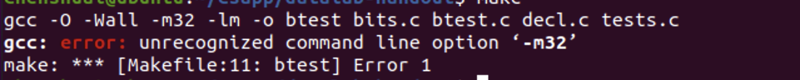
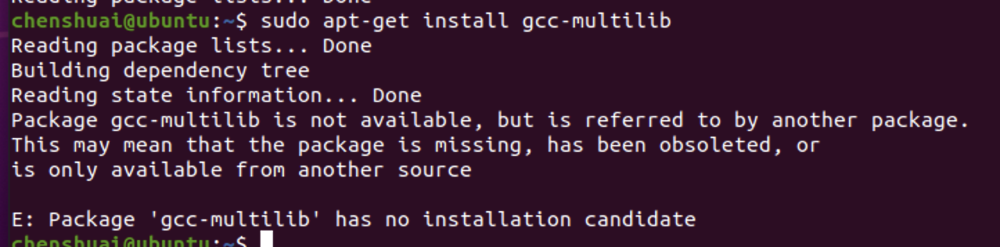

# CSAPP Lab实验环境配置 for M1

## 使用Parallels Desktop配置

调用make编译的时候报错



google可以安装`gcc-multilab`解决`-m32`错误



遗憾的是`gcc-multilab`安装不了，因为Arm gcc/g++的-m编译参数中不支持32位或者64位。

## 使用docker配置

按照网上教程很顺利的配置完了🎉
https://zhuanlan.zhihu.com/p/502375486

需要注意的是解决`Failed to download metadata for repo ‘AppStream’ [CentOS]`错误

```
cd /etc/yum.repos.d/
sed -i 's/mirrorlist/#mirrorlist/g' /etc/yum.repos.d/CentOS-*
sed -i 's|#baseurl=http://mirror.centos.org|baseurl=http://vault.centos.org|g' /etc/yum.repos.d/CentOS-*
yum update -y
```

- make简介: https://www.ruanyifeng.com/blog/2015/02/make.html
- Arm上的-m32问题: https://bbs.huaweicloud.com/blogs/126968
