# js 对象总结
## 1. 原型的工作原理
### 目的：
在软件开发过程中，为了避免重复造轮子，我们希望尽可能的复用代码。继承是代码复用的一种方式，继承有助于合理的组织代码，将一个对象的属性扩展到另一个对象上。JavaScript使用原型实现继承。
### 原理：

```js
const yoshi = {skulk: true};
const hattori = {sneak: true};
const kuma = {creap: true};

//使用setPrototypeOf方法将hattori设置为yoshi的对象原型
Object.setPrototypeOf(yoshi, hattori);
//使用setPrototypeOf方法将hattori设置为yoshi的对象原型
Object.setPrototypeOf(hattori, kuma);
```

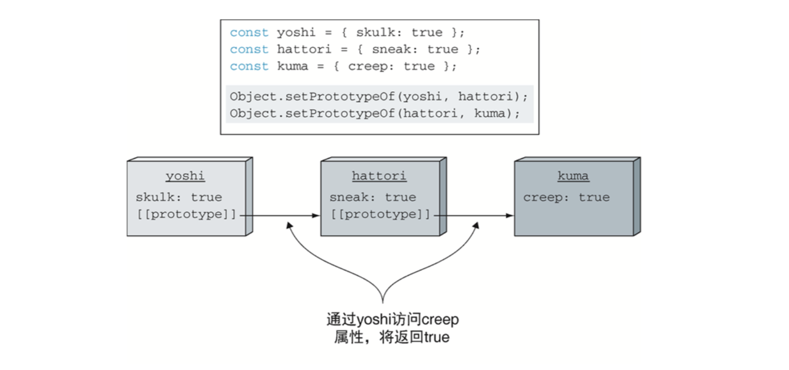

1. 每个对象都含有原型引用，当查找属性时，若对象本身不具有该属性，则会查找原型上是否有该属性。

2. 对象的原型属性是内置属性（使用标记[[prototype]]）。无法直接访问。内置方法Object.setPrototypeOf需要传入两个对象作为参数，并将第二个对象设置为第一个对象的原型。

3. 每个对象都有一个原型，每个对象的原型也可以拥有一个原型，以此类推形成一个原型链。查找特定属性将会被委托在整个原型链上，只有当原型链上没有更多原型可以查找时，才会停止查找。

## 2. 原型与构造函数关系

### 1. 构造函数实现

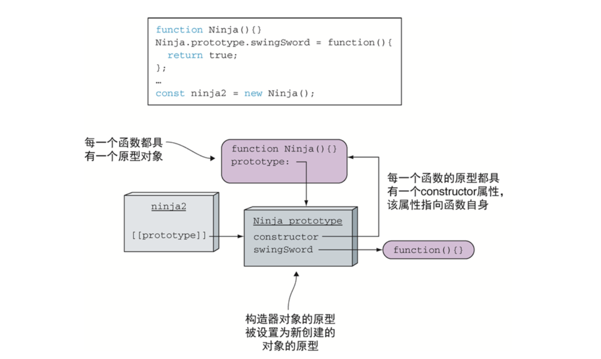

1. JavaScript使用new操作符，通过构造函数初始化新对象，但是没有真正的类定义。通过new操作符创建一个新对象分配。new操作符返回的是新对象的引用。

2. 每个函数都有一个原型对象，该原型对象指向创建对象的函数。

3. 每个函数的原型都有constructor属性，该属性指向函数本身。

### 2. 实例隐藏原型中与实例方法重名的方法

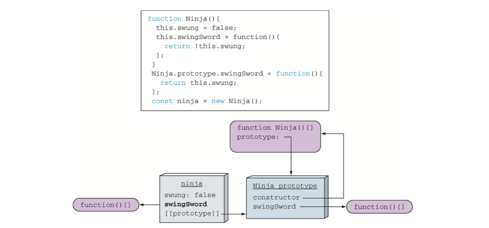

1. 在构造函数内部，关键字this指向新创建的对象，所以在构造器内添加的属性直接在新的ninja实例上。当通过ninja访问SwingSword属性时，就不需要遍历原型链，就可以在构造器内部找到属性。（在实际代码中不要这样做）

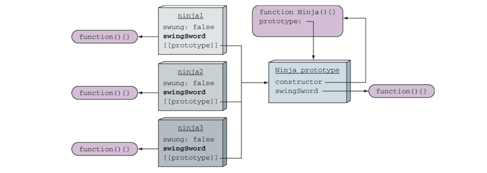

2. 副作用1：连续创建多个实例，每个实例都有自己的属性版本，但是他们都可以访问同一个原型属性。当所有实例对象是固定的属性值时，没有影响。但是可能会影响对象方法。

3. 副作用2：每个复制方法都一样，创建大量无意义的复制文件，占用内存。一般来说JavaScript引擎会执行一些优化，但不能依赖JavaScript引擎。从这个角度看，只在函数的原型上创建对象方法很有意义，这样可以使得同一个方法由所用对象实例共享。

### 3. 动态特性的副作用-通过原型，一切都可以在运行时修改

```js
//定义一个构造函数
function Ninja() {
    this.swung = true;
}

//通过new 调用构造函数，创建实例ninja1
const ninja1 = new Ninja();

//在原型上添加一个方法
Ninja.prototype.swingSword = function() {
    return this.swung;
}

//验证该方法存在于对象中
assert(ninja1.swingSword(), "Method exists, even out of order.");

//重写Ninja对象原型，仅有一个pierce方法
Ninja.prototype = {
    pierce: function() {
        return true;
    }
}

//尽管已经替换了Ninja构造器原型，但是实例化后的Ninja对象仍然具有swingSword方法，因为对象ninja1仍然保持着对旧的Ninja原型的引用
assert(ninja1.swingSword(), "Our ninja can still swing!");

//新创建的ninja2实例有新的原型引用，因此没有swingSword方法，仅有pierce方法
cosnt ninja2 = new Ninja();
assert(ninja2.pierce(), 'Newly created ninjas can pierce");
assert(ninja2.swingSword, "But they cannot swing!");
```

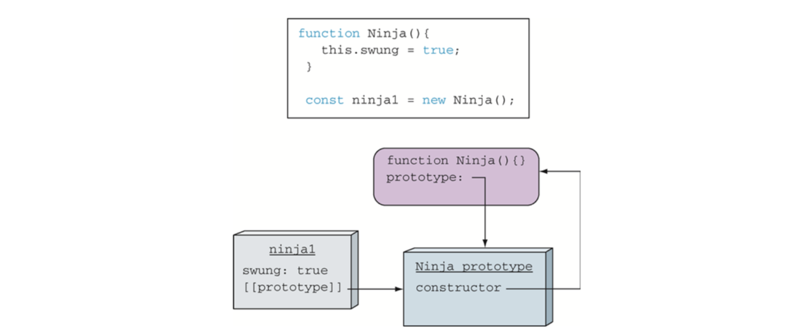

1. 构造完成后，ninja1具有swung属性，它的原型是Ninja原型，仅有一个构造属性。

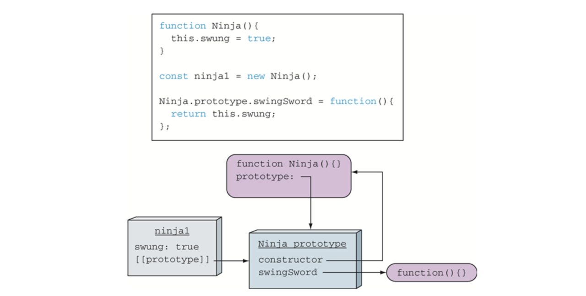

2. ninja1实例指向Ninja原型，在实例构造完成之后对原型做修改，该实例仍然能够访问。

3. 对象与原型之间的引用关系是在对象创建时建立的。新创建的对象将引用新的原型，它只能访问pierce方法。原来旧的对象保持原有的原型，仍然能够访问swingSword方法。

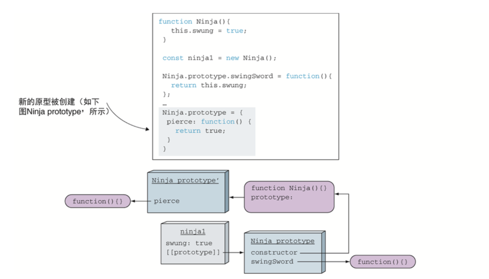

4. 函数的原型可以被任意替换，已经构建的实例引用旧的原型。

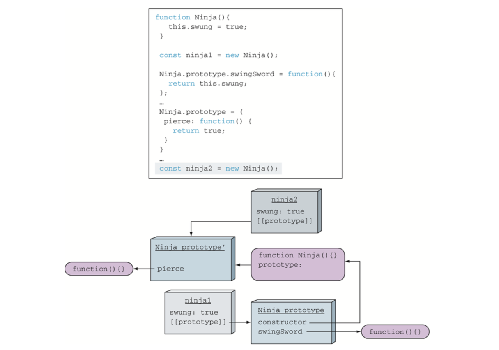

5. 新创建的实例引用新的原型。

### 4. constructor属性使用

```js
function Ninja() {}
const ninja = new Ninja();

//通过typeof 检测 ninja 的类型，但从结果仅仅能够得知ninja 是一个对象而已             
assert(typeof ninja === "object",
             "The type of the instance is object.");
     
//通过instanceof检测ninja类型，ninja由Ninja构造而来                                
assert(ninja instanceof Ninja,
             "instanceof identifies the constructor." );

//通过constructor引用检测ninja类型，得到构造函数的引用
assert(ninja.constructor === Ninja,
             "The ninja object was created by the Ninja function.");
```                           
  
1. 所有的实例对象都可以访问constructor属性，该属性是创建实例对象的函数的引用。我们可以使用constructor属性验证实例的原始类型。

```js
function Ninja() {}

const ninja = new Ninja();
//通过第一个实例化对象的constructor方法创建第二个实例化对象
const ninja2 = new ninja.constructor();

//说明新创建的ninja2对象是Ninja的实例
assert(ninja2 instanceof Ninja, "It't a Ninja!");
//ninja 和ninja2不是同一个对象，是两个截然不同的实例
assert(ninja !== ninja2, "But not the same Ninja!");
```

2. 由于constructor属性仅仅是原始构造函数的引用，因此我们可以使用该属性创建新的Ninja对象。

## 3. 模拟面向对象特性-继承

### 1. 实现原型继承

实现：一个对象的原型是另一个对象的实例：SubClass.prototype = new SuperClass();

```js
function Person() {}
Person.prototype.dance = function() {};

function Ninja() {}

//通过将Ninja的原型赋值为Person的实例，实现Ninja继承Person
Ninja.prototype = new Person();

const ninja = new Ninja();
                                    
assert(ninja instanceof Ninja,                      
       "ninja receives functionality from the Ninja prototype");
assert(ninja instanceof Person, "... and the Person prototype");
assert(ninja instanceof Object, "... and the Object prototype");
assert(typeof ninja.dance === "function", "... and can dance!")                           
```
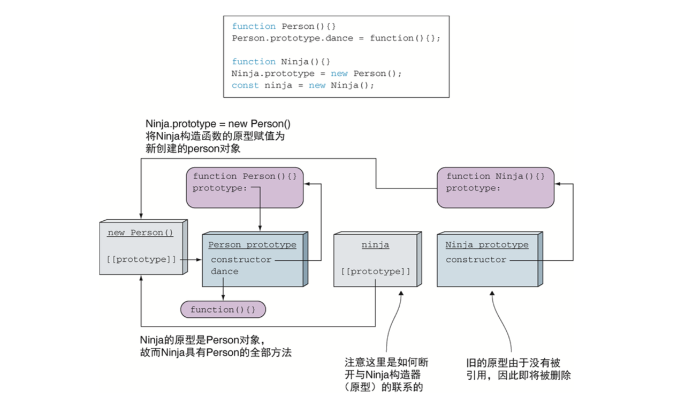

1. 这里存在一个问题：Ninja函数的prototype指向了Person实例，不再引用Ninja原型，因此丢失了Ninja与Ninja原型之间的关联。

2. 我们需要constructor属性，因为constructor属性用于检测一个对象是否由某个函数创建。例如执行：

```js
assert(ninja.constructor === Ninja, "The ninja object was created by the Ninja constructor");                                        
```

目前我们无法查找到 Ninja 对象的 constructor 属性。回到原型上，原型上也没有 constructor 属性，继续在原型链上追溯 ，在 Person 对象的原型上具有指向 Person 本身的 constructor 属性，我们最终得到的答案是 Person，但是这个答案是错误的。 这可能是某些严重错误的来源。

### 2. 解决constructor属性被覆盖问题

1. 配置对象的属性：在 JavaScript 中，对象是通过属性描述(property descriptor)进行描述的  

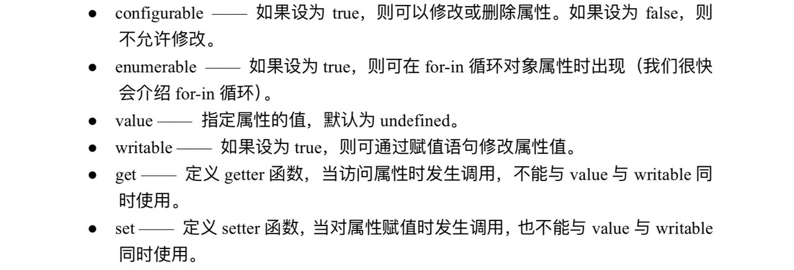

```js
//创建空对象，并添加对象属性
var ninja = {};
ninja.name = "Yoshi";
ninja.weapon = "Kusarigama";

//使用内置方法Object.defineProperty设置对象属性的配置信息：不可配置，不可枚举，值为true, 可写入
Object.defineProperty(ninja, "sneaky", {
    configurable:false,
    enumerable:false,
    value:true,
    writable:true
});

//可访问新的属性sneak
assert("sneaky" in ninja, "We can access the new property");

//遍历出name, weapon。sneaky不可遍历
for(let prop in ninja) {
    assert(prop !== undefined, "An enumerated proterty: " + prop);
}
```                               

2. 使用Object.defineProperty方法

```js
function Person() {}
Person.prototype.dance = function() {};

function Ninja() {}
Ninja.prototype = new Person();

//定义一个新的不可枚举的constructor属性，属性值为Ninja
Object.defineProperty(Ninja.prototype, "constructor", {
    enumerable: false,
    value: Ninja,
    writable: true
});

var ninja = new Ninja();

//Ninja.prototype对象新增constructor属性, 即constructor属性指向Ninja。
assert(ninja.constructor === Ninja, "Constructor from ninja instances to Ninja constructor reeatablished!");

//Ninja.prototype没有可以枚举的属性
for(let prop in Ninja.prototype) {
    assert(prop === "dance", "The only enumerable property is dance!");
}
```

### 3. instanceof的使用注意

instanceof操作符原理：检查右边的函数原型是否存在于左边的对象的原型链上。
常犯的错误是：以为instanceof操作符是检测对象是否是由某一个函数的构造器创建的。

```js
function Ninja() {}

const ninja = new Ninja();

assert(ninja instanceof Ninja, "Our ninja is a Ninja");
//修改Ninja的原型，虽然ninja仍然由Ninja构造器创建，但是instanceof操作符结果显示ninja不再是Ninja的实例了。
Ninja.prototype = {};
assert(ninja ： Ninja, "The ninja is now not a Ninja");
```

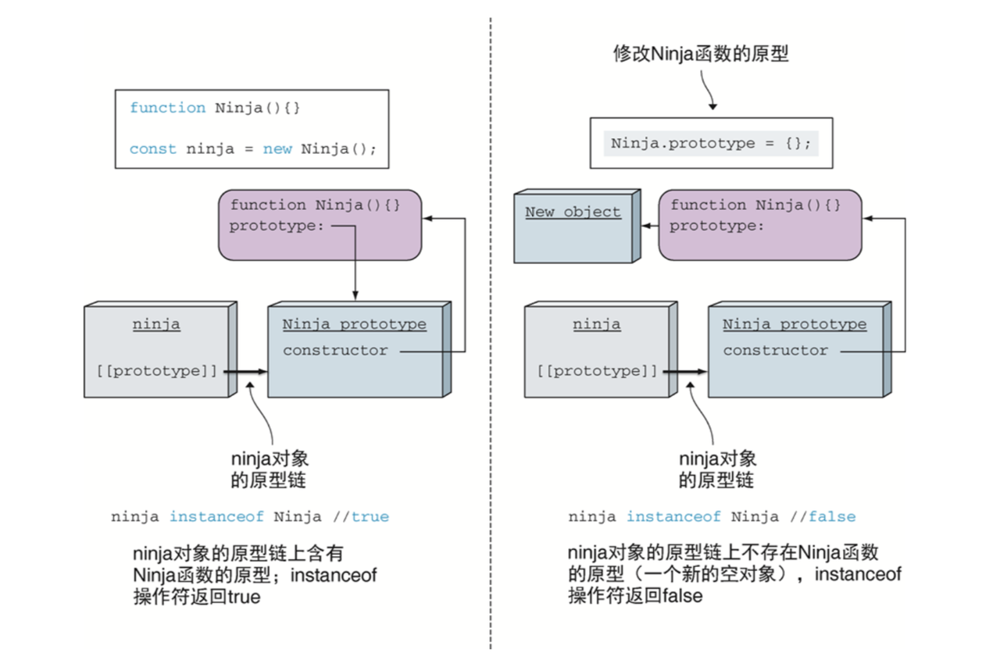

## 4. ES6关键字class

ES6新引入了关键字class实现创建对象和继承，但底层仍然是基于原型的。

### 1. ES6与ES5创建类比较

```js
//ES6:
class Ninja {
//定义一个构造函数，当使用关键字new调用类时，会调用这个构造函数。
    constructor(name) {
        this.name = name;
    }
    swingSword() {
        return true;
    }
//定义一个静态方法
    static compare(ninja1, ninja2) {
        return ninja1.level - ninja2.level;
    }
}
var ninja = new Ninja("Yoshi");

//ES5:
function Ninja(name) {
    this.name = name;
}
Ninja.prototype.swingSword = function() {
    return true;
}
Ninja.compare = function(ninja1, ninja2) {
    return ninja1.level - ninja2.level;
}
```

### 2. 实现继承对比

```js
//ES6：
class Person {
    constructor(name) {
        this.name = name;
    }
    dance() {
        return true;
    }
}

class Ninja extends Person {
    constructor(name, weapon) {
//关键字super调用基类的构造函数
        super(name);
        this.weapon = weapon;
    }
    wieldWeapon() {
        return true;
    }
}

var person = new Person("Bob");
var ninja = new Ninja("Yoshi", "Wakizashi");

//ES5:
function Person() {}
Person.prototype.dance = function() {};

function Ninja() {}
Ninja.prototype = new Person();

Object.defineProperty(Ninja.prototype, "constructor", {
    enumerable: false,
    value: Ninja,
    writable:true
});
```