# 《JavaScript 忍者秘籍》函数总结
## 1.函数调用
### 1.隐式函数参数                            
当调⽤函数时，除了传⼊入在函数定义中显式声明的参数之外，同时还传⼊两个隐式参数:arguments 与 this。
- arguments 参数是传⼊入函数的所有参数的集合。具有 length 属性，表示传⼊入参数的个数，通过 arguments 参数还可获取那些与函数形参不匹配的参数。在⾮严格模式下，arguments 对象是函数参数的别名，修改 arguments 对象会修改函数实参，可以通过严格模式避免修改函数实参。  
- this 表示函数上下⽂，即与函数调用相关联的对象。函数的定义方式和调用⽅式决定了了 this 的取值。
### 2.函数调用                                                      
- 作为函数调用：skulk()                                                       
- 作为⽅法调⽤:ninja.skulk()。                                                   
- 作为构造函数调⽤:new Ninja()。                                                     
- 通过 apply 与 call ⽅法调用:skulk.apply(ninja)或 skulk.call(ninja)。    
### 3.函数上下文
1.函数的调⽤⽅式影响 this 的取值。                                                    
- 如果作为函数调用，在⾮严格模式下，this 指向全局 window 对象;在严格模式下，this 指向 undefined。                                                    
- 作为方法调⽤，this 通常指向调用的对象。                                                
- 作为构造函数调用，this 指向新创建的对象。                                                 
- 通过 call 或 apply 调⽤，this 指向 call 或 apply 的第一个参数。

2.箭头函数没有单独的 this 值，this 在箭头函数创建时确定。     
                                                  
3.所有函数均可使⽤bind ⽅法，创建新函数，并绑定到 bind ⽅法传⼊的参数上。被绑定的函数与原始函数具有一致的⾏为。
## 2.闭包和作用域
### 1.执行上下文栈（调用栈）
#### 概念：
1. JavaScript 代码有两种类型:一种是全局代码，在所有函数外部定义;一种是函数代码，位于函数内部。JavaScript 引擎执行代码时，每一条语句都处于特定的执行上下文中。

2. 两种类型的代码对应两种执行上下文：全局执行上下文和函数执行上下文。全局执行上下文只有一个，当JavaScript开始执行时就已经创建了全局上下文。函数执行上下文是每次调用函数时，就会创建一个新的。

3. 区分函数执行时通过关键字this访问的函数上下文和执行上下文，执行上下文是内部的JavaScript概念，JavaScript引擎通过使用执行上下文跟踪函数的执行。

#### 作用：                            
1. 跟踪函数的执行，JavaScript 基于单线程的执行模型:在某个特定的时刻只能执行特定的代码。一旦发生函数调用，当前的执行上下文必须停止执行，并创建新的函数执行上下文来执行函数。当函数执行完成后，将函数执行上下文销毁，并重新回到发生调用时的执行上下文中。所以需要跟踪执行上下文——正在执行的上下文以及正在等待的上下文。最简单的跟踪方法是使用执行上下文栈(或称为调用栈)。

2. 执行上下文除了可以跟踪应用程序的执行位置之外，对于标识符也是至关重要，在静态环境中通过执行上下文可以准确定位标识符实际指向的变量。
#### 原理：

1. 每个JavaScript程序只创建一个全局执行上下文，并从全局执行上下文开始执行，由于是单线程同一时间只能执行特定代码。当执行全局代码时，全局执行上下文处于活跃状态。

2. 在全局代码中定义skulk和report函数，当执行skulk('Kuma')函数时，由于是单线程，JavaScript引擎停止执行全局代码，创建新的skulk执行上下文，并压入执行上下文栈顶部。

3. skulk函数调用report函数，JavaScript引擎暂停skulk执行上下文，创建新的report执行上下文，并压入执行上下文栈顶部。

4. report函数执行完成，report执行上下文从栈顶弹出，skulk执行上下文重新激活，skulk函数重新执行。

5. skulk函数执行过程类似，执行完成后从栈顶弹出，重新激活全局执行上下文并恢复执行。JavaScript全局代码恢复执行。

### 2.词法环境（作用域）
#### 概念：                     
1. 词法环境是JavaScript作用域的内部实现机制，人们通常称为作用域(scopes)。

2. 通常来说，词法环境与特定的 JavaScript 代码结构关联，既可以是一个函数、一段代码片段，也可以是 try-catch 语句。这些代码结构(函数、代码片段、try-catch)可以具有独立的标识符映射表。

3. 代码嵌套，词法环境主要基于代码嵌套，通过代码嵌套实现代码结构包含另一代码结构。在作用域范围内，每次执行代码时，代码都将获得与之关联的词法环境（每个执行上下文都有一个与之关联的词法环境）。


4. 代码嵌套与词法环境。除了跟踪局部变量，函数声明，函数的参数和词法环境外，还有必要跟踪外部（父级）词法环境。如果在当前环境中无法找到某个标识符，就需要访问外部环境在外部代码结构中查找。如果查找到了就会停止查找，如果查找到全局环境仍没有找到就会报错并停止查找。

5. 每个执行上下文都有一个与之关联的词法环境，词法环境中包含了上下文中定义的标识符的映射表。在特定的执行上下文中，程序不仅直接访问词法环境中定义的局部变量，而且还会访问外部环境中定义的变量。如何访问？见原理
#### 作用：
1.词法环境(lexical environment)是JavaScript引擎内部用来跟踪标识符与特定变量之间的映射关系。                    
                         
#### 原理：

1. 无论何时创建函数，都会创建一个与之关联的词法环境，并存储在[[Enviroment]]的内部属性上。skulk函数保存全局环境的引用，report函数保存skulk环境引用，因为这些都是函数被创建时所在的环境。

2. 无论何时调用函数，都会创建一个新的函数执行上下文，并推入执行上下文栈，此外，还会创建一个与之相关联的词法环境。JavaScript引擎将此函数内置的[[Environment]]属性与创建此函数时的环境关联。skulk关联的是全局环境，report关联的是skulk环境。

3. 当调用skulk函数时，外部环境（这里是包含变量nijia的环境）与新创建的skulk环境成为全局环境，调用report函数时，外部环境（包含变量action的环境）与新创建的report环境被放入skulk环境中。

4. 执行report函数时，首先需要查找intro标识符的值，JavaScript引擎先检查当前执行上下文中的report函数环境，report环境中有intro变量的引用，所以intro标识符查找完成。

5. 查找ation标识符，又一次需要检查当前执行上下文的环境，report函数环境没有action标识符，JavaScript引擎查找report外部环境，skulk环境。skulk环境包含action标识符的引用，查找完成。查找ninja过程类似。
## 3.关键字const, let, var与词法环境
### 变量可变性：
1. 按照可变性划分，const声明的变量不可变，var，let声明的变量可变。

2. const变量只能在声明时被初始化一次，之后再也不允许赋值。const主要用于不需要重新赋值的特殊变量或者指向一个固定的值。如const MAX_RONIN_COUNT = 11指定球队最大人数。

3. const一个重要特性，我们不能重写const变量，但是可以修改const变量已有对象。 

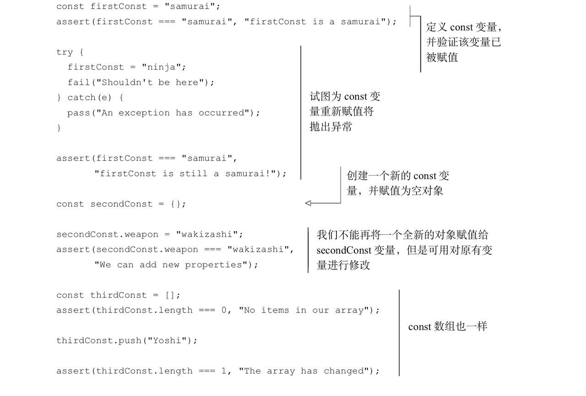                     

### 关键字与词法环境关系：
1. 按照词法环境（作用域）可以将var分一组，let，const分一组。

2. 通过var声明的变量实际上总是在距离最近的函数内或者全局词法环境中注册的，不关注块级作用域。

```js
var globalNinja = "Yoshi";
                                    
function reportActivity() {
    var functionActivity = "jumping";                                    
    for (var i = 1; i < 3; i++) {
        var forMessage = globalNinja + " " + functionActivity;
//for循环中可以访问块级变量，函数内的局部变量，全局变量
        assert(forMessage === "Yoshi jumping","Yoshi is jumping within the for block");
        assert(i, "Current loop counter:" + i);                                
    }
//for循环外部可以访问for循环内部的变量                            
    assert(i === 3 && forMessage === "Yoshi jumping","Loop variables accessible outside of the loop");
}
                                    
reportActivity();
//函数外部无法访问函数内部的局部变量
assert(typeof functionActivity === "undefined"&& typeof i === "undefined" && typeof forMessage === "undefined","We cannot see function variables outside of a function");        
                                
//变量 forMessage 与 i 虽然是被包含在 for 循环中，但实际是在 reportActivity 环境中注册的 
```                                
 
                                 
3.如下如所示，这里有三种词法环境：
- 变量globalNinja是在全局环境中定义的（距离最近的函数内或者全局词法环境）
- reportActivity函数创建的函数环境，包含变量functionaActivity，i，forMessage，这3个变量均通过关键字var定义的，与他们最近的是reportActivity函数，所以这几个变量实际是在reportActivity环境中注册。
- for循环的块级作用域，关键字var的变量忽略块级作用域。所以for循环里没有变量注册。
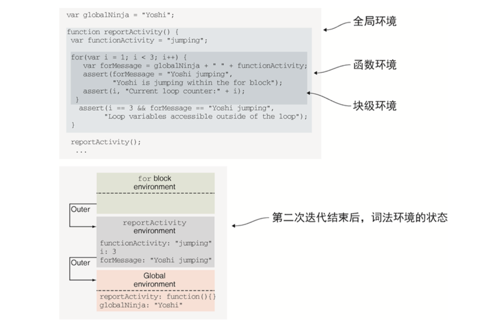

4. let和const在最近的词法环境中定义变量（可以是在块级作用域，循环内，函数内或者全局环境内）。可以使用let和const定义块级别，函数级别，全局级别的变量。

5. 如下图所示：
- 使用let定义的变量 forMessage与 i 是在 for 循环的块级作用域中定义的。变量在for块级环境中注册。
- 使用let定义的变量 functionActivity 是在函数 reportActivity 中定义的。变量在reportActivity函数级环境中注册。
- 使用const定义的变量GLOBAL_NINJA 是在全局环境中定义的。变量在全局环境中注册。           
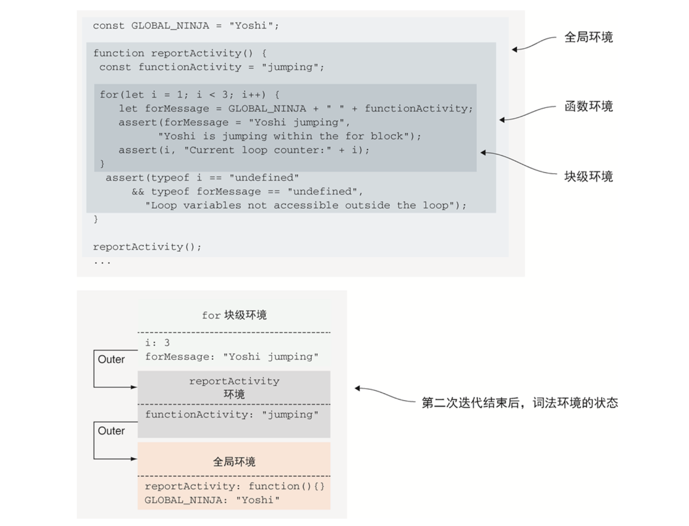
### 在词法环境中注册标识符:
#### 概念：
JavaScript代码执行分两个阶段进行：
- 第一阶段：创建新的词法环境就会执行，这一阶段没有执行代码，JavaScript引擎会访问并注册在当前词法环境中声明的变量和函数。
- 第二阶段：第一阶段执行完毕后开始执行第二阶段，具体如何执行取决于变量的类型（let，var，const，函数声明）以及环境的类型（全局环境，函数环境，块级环境）。                         

第二阶段具体的执行过程：


1. 如果创建的是一个函数环境，函数的形参和函数参数的默认值会一同被创建，如果不是函数环境，跳过此步骤。

2. 如果创建的是一个全局或者函数环境，扫描当前代码并声明函数，此过程不会扫描其他函数体，也不会执行函数表达式或者箭头函数。对通过扫描找到的所有函数声明，会创建一个新函数并绑定到当前环境与函数名同名的标识符上。假如标识符的名字已经存在，它的值就会被新建的函数重写。假如不是全局或者函数环境，将会跳过此步骤。

3. 如果当前环境不是块级环境，查找所有在函数外，var声明的变量（它们可以被置于块级环境内 ）。还会查找所有在块级环境外，let和const声明的变量。如果是块级环境，在块级环境中查找在本块级环境中let和const声明的变量。对于被找到的每个变量，如果当前环境不存在此变量，就会创建标识符并初始化为undefined。如果标识符存在，就会保留其值。

#### 作用：
##### 1.函数声明之前调用函数：
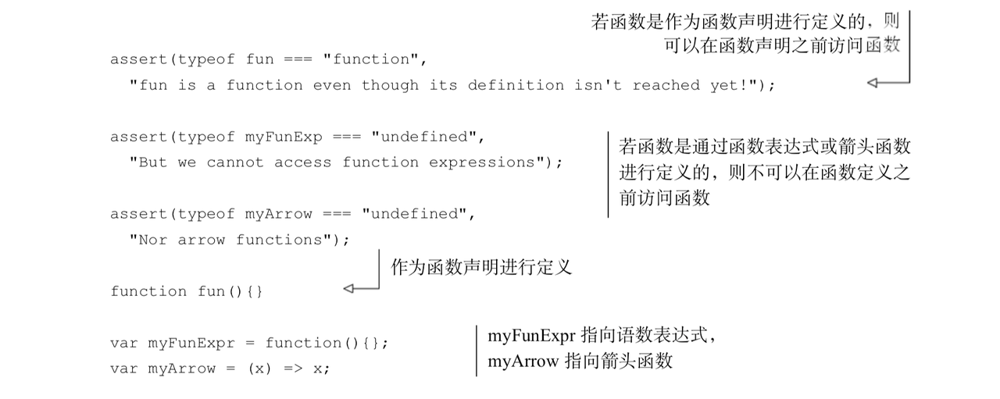
1. fun函数是通过函数声明进行定义的，在当前词法环境创建时，其他代码执行之前，就已经注册了函数的标识符。所以在执行函数调用之前，fun函数已经存在。

2. JavaScript允许我们直接使用函数引用，而不需要强制指定函数的顺序。

3. 需要特别注意的是，这种情况仅针对函数声明有效，函数表达式与箭头函数不在此过程中定义，而是在程序执行过程中定义的。
##### 2.函数重载:
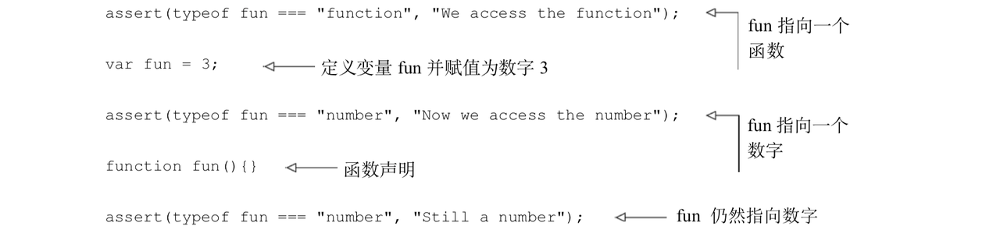
1. 声明的变量和函数使用相同的名字fun，两个断言都通过了，在第一个断言中标识符fun指向一个函数，在第二个断言中标识符指向一个数字。

2. JavaScript的这种行为是由标识符注册的结果导致的。在注册过程的第2步，通过函数声明进行定义的函数，在代码执行之前创建该函数，并赋值给对应的标识符；在注册第三步，处理变量的声明，那些在当前环境中未声明的变量，将被赋值为undefined。

3. 执行第一个断言fun === 'function'通过的原因是：通过注册过程第2步，注册函数声明时，标识符fun已经存在，并未被赋值为undefined。执行第二个断言fun === 'unmber'通过的原因是：执行赋值语句var fun = 3，数字3赋值给标识符fun，执行完这个赋值语句后，fun不再指向函数，而是指向数字3。
## 4.闭包原理
### 概念：
1. 一个持有外部环境变量的函数就是闭包。

2. 闭包是词法作用域的体现，闭包是词法作用域链的延长，闭包和作用域是强相关的。

3. 闭包允许函数访问并操作函数外部的变量。只要变量或者函数存在于声明函数时的作用域内，闭包就可以使函数访问这些变量或函数。

4. 闭包内声明的函数可以在声明之后的任何时间被调用，甚至当该函数声明的作用域消失之后仍然可以调用。

5. 闭包影响性能。每一个通过闭包访问变量的函数都具有一个作用域链，作用域链包含闭包的全部信息。使用闭包时所用的信息都会存储在内存中，知道JavaScript引擎确保这些信息不再使用或者页面卸载时，才会进行垃圾回收清理这些信息。

### 作用：

#### 1.全局作用域中的闭包
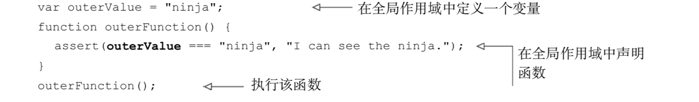
1. 以上代码就是一个闭包。

2. 外部外部变量outerValue和外部函数outerFunction都是在全局作用域内声明的，该作用域（实际上就是一个闭包）从未消失（只要应用处于运行状态）。该函数可以访问外部变量。

#### 2.函数内部的闭包，函数在函数内部声明。（封装私有变量、回调函数）
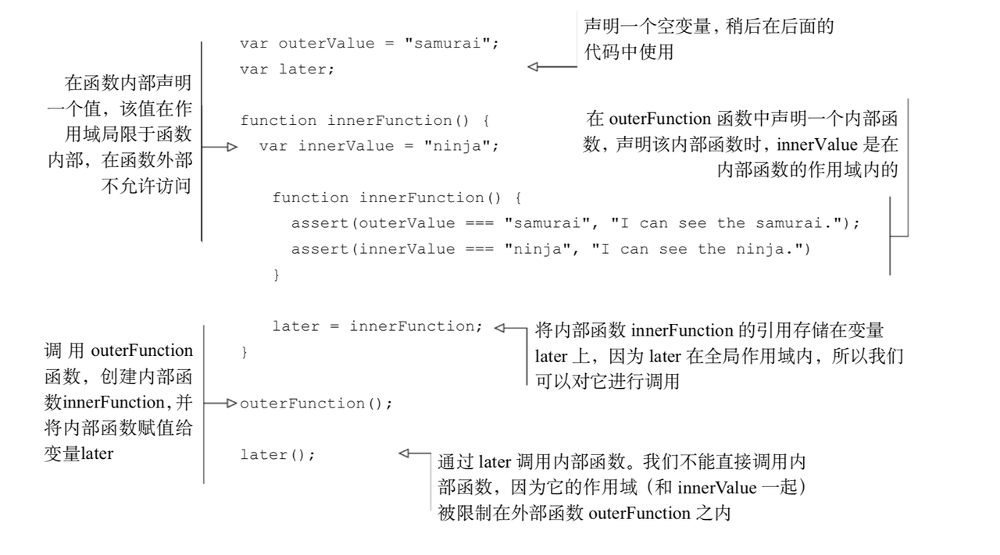
1. 当外部函数中声明内部函数时，不仅定义了函数声明，而且还创建了一个闭包。

2. 该闭包不仅包含了函数的声明，还包含了函数声明时该作用域内的所用变量。

3. 当最终执行内部函数时，尽管声明时作用域已经消失了 ，但是通过闭包，仍然能够访问到原始作用域。

### 原理：
#### 1. 闭包模拟私有变量
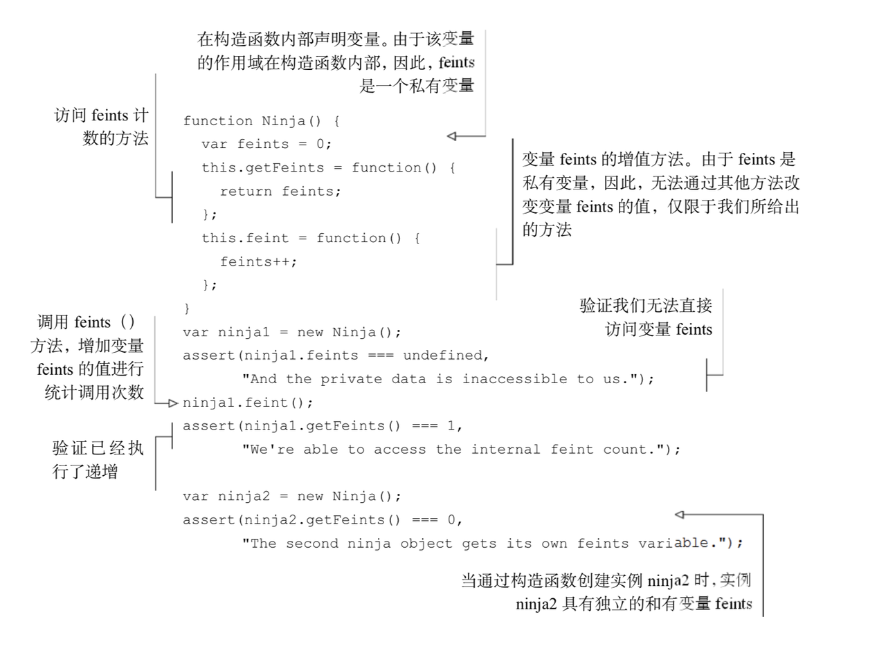
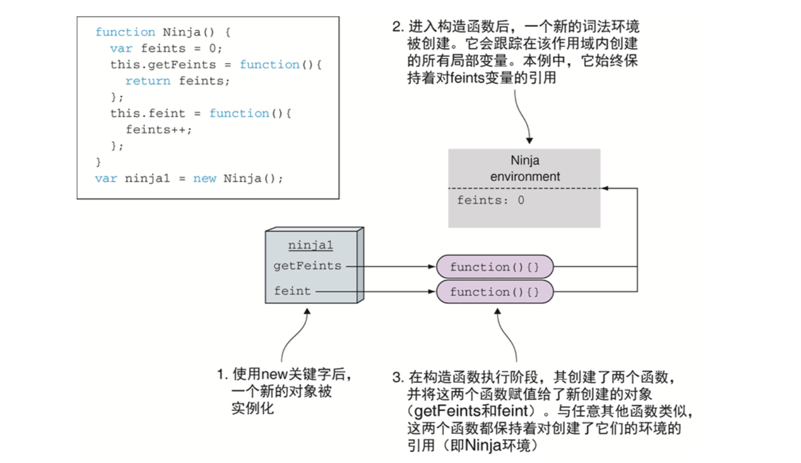

1. 创建完成ninjia1后的状态。通过关键字new调用JavaScript 构造函数。每次调用构造函数时，都会创建一个新的词法环境，该词法环境保持构造函数内部的局部变量。

2. 创建函数时，函数都会通过内置的[[Environment]]属性保持对词法环境的引用。Ninja构造函数内部，getFeints和feint都有对Ninja环境的引用。因为Ninja环境是两个函数创建时所处的环境。

3. 可以通过Ninja构造函数内部访问getFeints与feint函数，实际上这就是创建了包含feints变量的闭包。

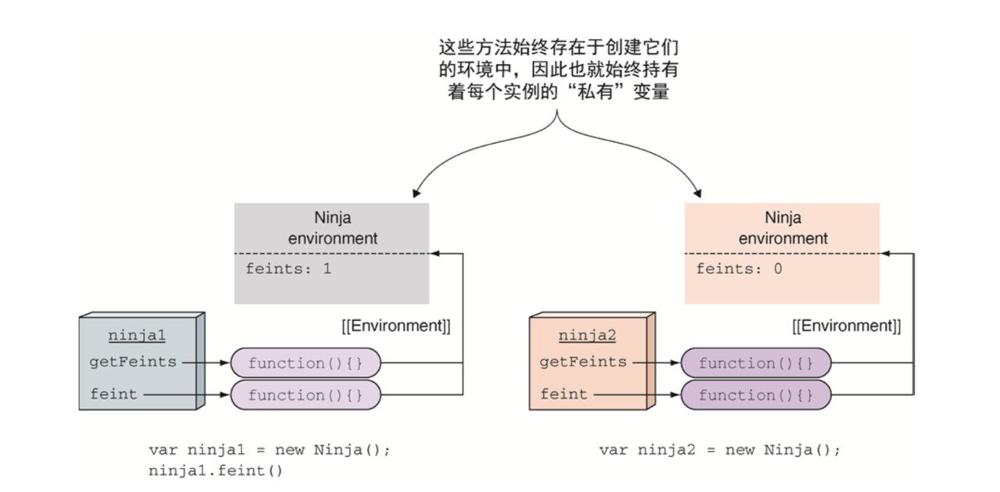

4. 当再创建一个Ninja的实例，ninja2时，将重复整个过程。

5. 每一个通过 Ninja 构造函数创建的对象实例均获得了各自的方法(ninja1.getFeints与 ninja2.getFeints 是不同的)，当调用构造函数时，各自的实例方法包含各自的变量。

6. 在调用 ninja2.getFeints 方法之前，JavaScript 引擎正在执行全局代码。我们的程序处于全局执行上下文状态，是执行栈里的唯一上下文。同时，唯一活跃的词法环境是全局环境，与全局执行上下文关联。

7. 当调用 ninja2.getFeints()时，我们调用的是 ninja2 对象的 getFeints 方法。由于每次调用函数时均会创建新的执行上下文，因此创建了新的getFeints执行环境并推入执行栈。这同时引起创建新的词法环境，词法环境通常用于保持跟踪函数中定义的变量。另外，getFeints 词法环境包含了 getFeints 函数被创建时所处的Ninja环境，当 ninja2 对象构建时，Ninja 环境是活跃的。

8. 获取 feints 变量时。首先，访问活跃的 getFeints词法环境。因为在 getFeints 函数内部未定义任何变量，该词法环境是空的，找不到 feints变量。接下来，在当前词法环境的外部环境进行查找——本例中，当创建 ninja2 对象时，Ninja 环境处于活跃状态。Ninja 环境中具有 feints 变量的引用，完成搜索过程。


9. 将 ninja1 的对象方法 getFeints 赋值给一个新的 imposter对象。然后，当我们通过对象 impostor 的 getFeints 方法，发现仍然可以访问 ninja1对象的私有变量。         
 


10. 在JavaScript中没有真正的私有对象属性，但是可以通过闭包实现一种可以接受的“私有”变量的方案。

#### 2. 闭包和回调函数                                         


1. 每次调用 animateIt 函数时，均会创建新的词法环境❶❷，该词法环境保存了动画所需的重要变量(elementId、elem、动画元素、tick、计数次数、timer、动画计数器的 ID)。只要至少有一个通过闭包访问这些变量的函数存在，这个环境就会一直保持。
            
2. 浏览器会一直保持 setInterval 的回调函数，直到调用 clearInterval 方法。随后，当一个计时器到期，浏览器会调用对应的回调函数，通过回调函数的闭包访问创建闭包时的变量。这样避免了手动匹配回调函数的麻烦，并激活变量(❸❹❺)，极大地简化代码。             

## 5.生成器函数（generator)
### 概念：
#### 1. 通过迭代器对象控制生成器


1. 调用const weaponsIteror = WeaponGenerator();生成器，返回一个迭代器。迭代器用于控制生成器的执行。
2. const result1 = weaponsIterator.next();迭代器对象暴露基本接口next，调用next函数后，生成器开始执行代码，当代码执行到yield关键字时，就会生成一个中间结果，然后返回一个新对象{value:xx, done:xx}。
3. 每当生成一个当前值后，生成器就会非阻塞的挂起执行，等待下次值请求到达。
4. 当第三次执行next方法后，生成器恢复执行，但是没有更多可执行代码了，生成器返回一个对象结果{value:undefined, done:true},表明工作已经完成了。

#### 2. 对迭代器进行迭代


```js
//实际上是for-of的工作原理
for(var item of WeaponGenerator()) {
    assert(item !== null, item);
}
```

#### 3. 把执行权交给下一个生成器
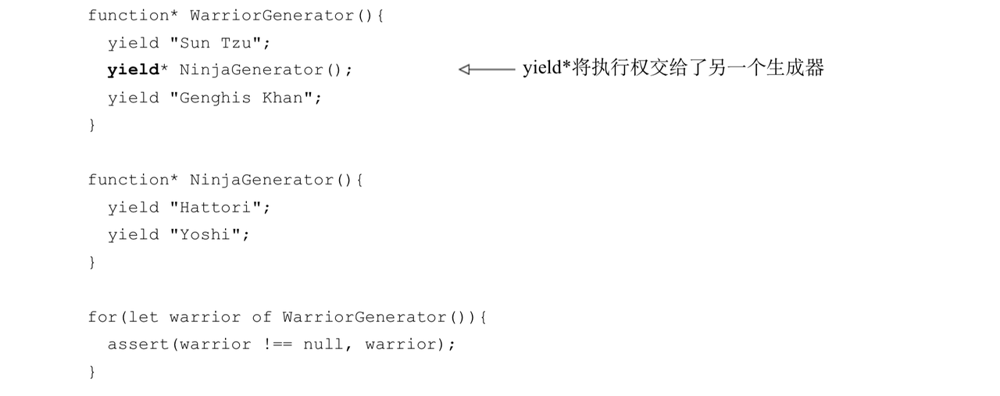

1. 在迭代器上执行yield* 操作符，程序会跳转到另外一个生成器函数上执行。

2. 程序从 WarriorGenerator 跳转到一个新的 NinjaGenerator 生成器上，每次调用WarriorGenerator 返回迭代器的 next 方法，都会使执行重新寻址到了 NinjaGenerator 上。该生成器会一直持有执行权直到无代码可以执行。

3. for-of循环不会关心 WarriorGenerator 委托到另一个生成器上，它只关心在 done 状态到来之前都一直调用 next 方法。

#### 4. 与生成器交互
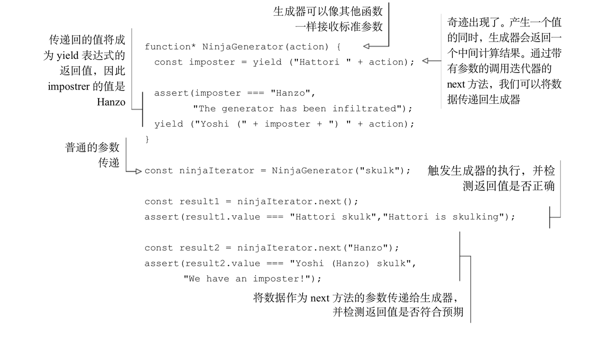

1. 作为生成器函数参数发送值。

2. 使用next方法向生成器发送值。                 
- 第二次调用 ninjaIterator 的 next 方法:ninjaIterator.next("Hanzo")。这一次，我们使用 next 方法将计算得到的值又传递回生成器。生成器函数在表达式 yield ("Hattori " + action)位置挂起，故而值 Hanzo 作为参数传入了 next()方法，并用作整个 yield 表达式的值。也就是表示语句 imposter = yield("Hattori " + action) 中的变量 imposter 会以值 Hanzo 作为结尾。

3. next方法为等待中的yield表达式提供了值，所以，如果没有等待中的yield表达式，也就没有值能应用了。基于这个原因我们无法通过第一次调用next方法来向生成器提供值。如果需要为生成器提供一个初始值，可以调用生成器自身。

#### 5. 抛出异常                                                         


### 使用：
#### 1. 生成ID 序列
```js
function *IdGenerator(){
    let id = 0;
    while(true){                            
    yield ++id;
    }                              
} 
                             
const idIterator = IdGenerator();                                    
const ninja1 = { id: idIterator.next().value };
const ninja2 = { id: idIterator.next().value };
```

#### 2. 使用生成器遍历Dom树
```js
function* DomTraversal(element){
  yield element;
  element = element.firstElementChild;
  while (element) {                                     
    yield* DomTraversal(element);                
    element = element.nextElementSibling;
  }                     
}                       
const subTree = document.getElementById("subTree");
for(let element of DomTraversal(subTree)) {                            
  assert(element !== null, element.nodeName);
}
```

### 原理：            
#### 1. 生成器的状态                     
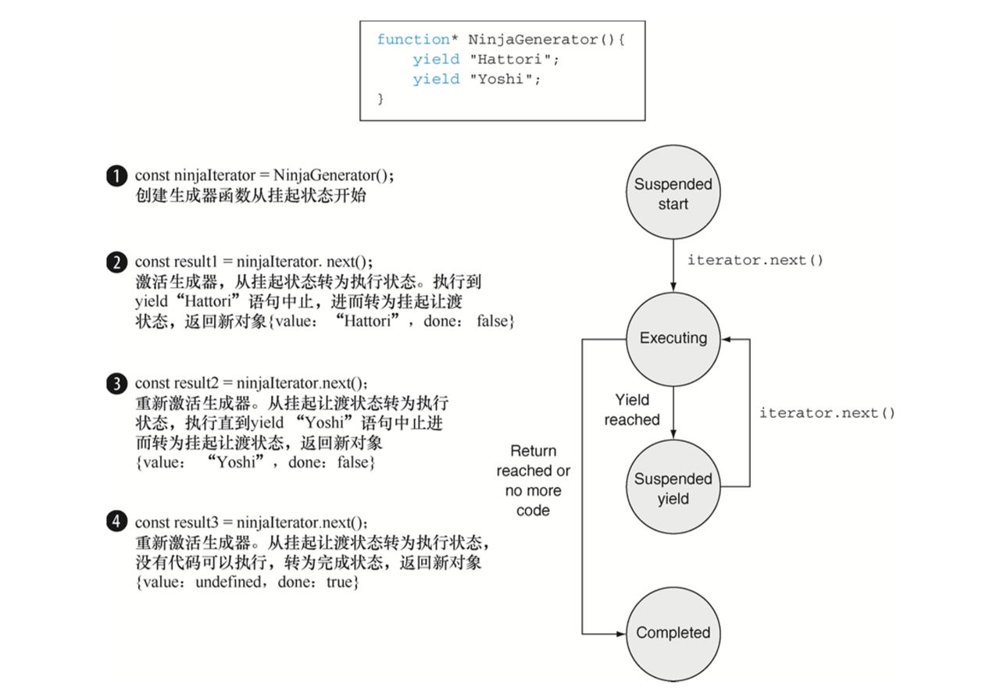

1. 挂起开始——创建了⼀个⽣成器后，它最先以这种状态开始。其中的任何代码都未执⾏。 

2. 执⾏——⽣成器中的代码已执⾏。执行要么是刚开始，要么是从上次挂起的时候继续的。当⽣成器对应的迭代器调用了 next 方法，并且当前存在可执⾏行行的代码时，生成器都会转移到这个状态。

3. 挂起让渡——当生成器在执⾏过程中遇到了一个 yield 表达式，它会创建一个包含着返回值的新对象，随后再挂起执行。⽣成器在这个状态暂停并等待继续执⾏。

4. 完成——在⽣成器执⾏期间，如果代码执行到 return 语句或者全部代码执⾏完毕，⽣成器就进入该状态。

#### 2. 通过执行上下文跟踪生成函数


1. 当我们调用 NinjaGenerator 函数: const ninjaIterator = NinjaGenerator("skulk"); 控制流则进入了生成器，当前将会创建一个新的函数环境上下文 NinjaGenerator(和相对应的词法字典并列)，并将该上下文入栈。而生成器比较特殊，它不会执行任何函数代码。取而代之则生成一个新的迭代器再从中返回，通过在代码中用 ninjaIterator 可以来引用这个迭代器。由于迭代器是用来控制生成器的执行的，进而迭代器中保存着一个在它创建位置处的执行上下文。
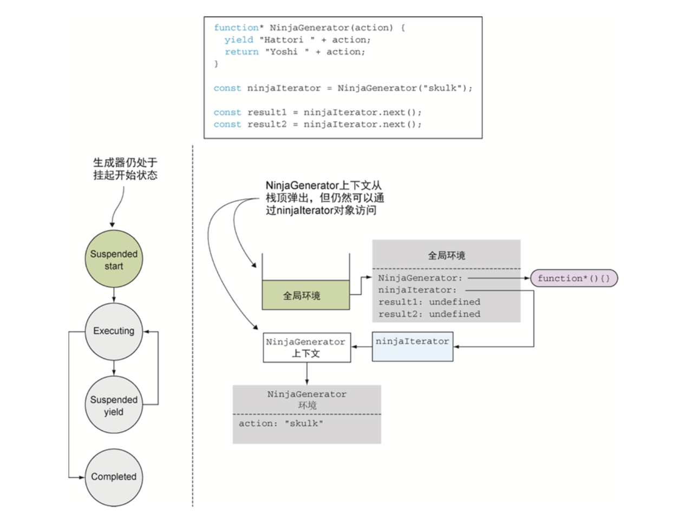

2. 当程序从生成器中执行完毕后，一般情况下，当程序从一个标准函数返回后，对应的执行环境上下文会从栈中弹出，并被完整地销毁。但在生成器中不是这样。由于 ninjaIterator 还保存着对它的引用，所以它不会被销毁。

3. 可以把它看作一种类似闭包的事物。在闭包中，为了在闭包创建的时􏰢保证变量都可用，所以函数会对创建它的环境持有一个引用。以这种方式，我们能保证只要函数还存在，环境及变量就都存在着。生成器，从另一个角度看，还必须恢复执行。由于所有函数的执行都被执行上下文所控制，故而迭代器保持了一个对当前执行环境的引用，保证只要迭代器还需要它的时候它都存在。


4. 当调用迭代器的 next 方法时const result1 = ninjaiterator.next();  如果这只是一个普通的函数调用，这个语句会创建一个新的 next()的执行环境上下文项，并放入栈中。但生成器不标准，对 next 方法调用的表现也很不同。它会重新激活对应的执行上下文。在这个例子中，是 NinjaGenerator 上下文，并把该上下文放入栈的顶部，从它上次离开的地方继续执行。                                                                          
5. 由于是第一次调用 next 方法，而生成器之前并没执行过，所以生成器开始执行并进入执行状态

6. 标准函数仅仅会被重复调用，每次调用都会创建一个新的执行环境上下文。相比之下，生成器的执行环境上下文则会暂时挂起并在将来恢复。


7. 当生成器函数运行到这个位置的时候 `yield "Hattori " + action；`生成器函数运行得到的表达式的结果为 Hattori skulk，然后执行中遇到了 yield 关键字。这种情况表明了Hattori skulk是该生成器的第一个中间值，所以需要挂起生成器的执行并返回该值。
8. 从应用状态的角度来看，发生了一件类似前面的事情:NinjaGenerator上下文离开了调用栈，但由于 ninjaIterator 还持有着对它的引用，它并未被销毁。现在生成器挂起了，又在非阻塞的情况下移动到了挂起让渡状态。程序在全局代码中恢复执行，并将生产出的值存入变量 result1。

9. 当遇到另一个迭代器调用时，代码继续运行: `const result2 = ninjaIterator.next();` 在这个位置，我们又把整个流程走了一遍:首先通过 ninjaIterator 激活 NinjaGenerator的上下文引用，将其入栈，在上次离开的位置继续执行。本例中，生成器计算表达式"Yoshi" + action。但这一次没再遇到 yield 表达式，而是遇到了一个 return 语句。这个语句会返回值 Yoshi skulk 并结束生成器的执行，随之生成器进入结束状态。

## 6.promise函数                                 
### 原理：


1. promise对象用于作为异步任务结果的占位符。它是一个我们暂时还没有获得但是未来有希望获得的值。
2. 一个promise对象从Pending状态开始，因为我们对promise一无所知，所有一个等待状态的promise对象也称作unresolved的promise。
3. 在程序执行过程中，如果promise的reslove函数被调用，promise就会进入Fulfilled状态。在该状态下能够获取到承诺的值。
4. 如果promise的reject函数被调用，或者一个未处理的异常在promise调用过程中发生了，promise就会进入Rejected状态。
5. 一旦某个promise进入到完成状态或者拒绝状态，它的状态都不能再切换了。
### 使用：                        
#### 1. 拒绝promise
```js
//1.显式拒绝：在promise执行函数中调用传入的reject方法
const promise = new Promise((resolve, reject)=>{
    reject('Explicitly reject a promise');
});
promise.then(
    ()=>fail("happy path, won't be called"),
//如果promise被拒绝，则第二个回调函数error总会被执行
    error=>pass("A promise was explicitly rejected!")
);

const promise = new Promise((resolve, reject)=>{
    reject("Explicitly reject a promise!");
});
//在then状态后链式调用catch方法，也可以在promise进入拒绝状态时提供错误回调函数
promise.then(()=>fail("happy path, won't be called"))
        .catch(()=>pass("Promise was also rejected"));

//2.隐式拒绝：promise执行过程中遇到异常，可以被隐式拒绝。
const promise = new Promise((reslove, reject)=>{
//未被定义的变量，执行时会报错
    undeclaredVariable++;
});
//发生了异常，第二个回调函数error被调用
promise.then(()=>fail("happy path, won't be called!"))
        .catch(error=>pass("third promise was also rejected!"));
```
#### 2. 链式调用
```js
function getJSON(url) {
  return new Promise((resolve, reject)=>{
    const request = new XMLHttpRequest();
      request.open('GET', url);
      request.onload = function () {
        try {
          if(this.status === 200) {
            resolve(JSON.parse(this.response));
          }else {
            reject(this.status + " " + this.statusText);
          }
        }catch (e){
            reject(e.message);
        }
        request.onerror = function() {
          reject(this.status + " " + this.statusText);
        );

        request.send();
      })
}

//链式调用，处理相互依赖的请求
getJSON("data/ninjias.json")
    .then(ninjas=>getJSON(ninjas[0].missionsUrl))
    .then(missions=>getJSON(missions[0].detailsUrl))
    .then(mission=>assert(mission !== null, 'ninja mission obtained!'))
    .catch(error=>fail('An error has occurred'));

//1.调用then方法后会返回一个新的promise对象。
//2.Promise中错误的捕捉：通过then方法传递第二个回调函数；链式的调用一个catch方法，并传入错误处理回调函数。
```

#### 3. Promise.all
```js
Promise.all([getJSON("data/ninjas.json"),
            getJSON("data/mapInfo.json"),
            getJSON("data/plan.json")])
        .then(results=>{
            const ninjas = results[0];
            const mapInfo = results[1]; 
            const plan = results[2];
            
        })
        .catch(error=>{
            fail("A problem in carrying out our paln!");
        })
//处理并行任务
//1.使用Promise.all可以等待多个promise。
//2.这个方法将一个promise数组作为参数，然后创建一个新的promise对象，一旦数组中的promise全部被解决，这个返回的 promise 就会被解决，而一旦其中有一个promise失败了，那么整个新promise对象也会被拒绝。
//3.后续的回调函数接收成功值组成的数组，数组中的每一项都对应 promise 数组中的对应项。 
```

#### 4. Promise.race 
```js
Promise.race([getJSON('/data/youshi.json'),
              getJSON('/data/hattori.json'),
              getJSONS('/data/hanzo.json')])
    .then(ninja=>{
        assert(ninja !== null, ninja.name + ' responded first');
    }).catch(error=>fail('Failure!'));

//1.一旦数组中某一个promise被处理或被拒绝，这个返回的promise就同样会被处理或被拒绝。
```

#### 5. generator和promise结合处理相互依赖的异步任务

```js
//1.代码相互依赖执行，如下使用同步代码会阻塞UI
try {
  const ninjas = syncGetJSON('data/ninjas.json');
  const missions = syncGetJSON(ninjas[0].missionsUrl);
  const missionDetails = syncGetJSON(mission[0].detailsUrl);
}catch {
    //some error occured.
}                        

//2.使用生成器和promise结合处理相互依赖运行的异步代码。
//我们不知道promise何时返回，所以生成器执行的时候，把控制权让渡给生成器，从而不会导致阻塞。
async(function*() {
    try {
        const ninjas = yield getJSON('data/ninjas.json');
        const mission = yield getJSON(ninjas[0].missionsUrl);
        const missionDescription = yield getJSON(mission[0].detailsUrl);
    }catch (e) {
        //some error occured
    }
})

function async(generator) {
    var iterator = generator();
    function handle(iteratorResult) {
//生成器没有更多结果返回时停止执行
        if(iteratorResult.done) {return;}
        const iteratorValue = iteratorResult.value;
//如果生成的值是一个promise，则对其注册成功和失败回调。这是异步处理的部分。如果promise成功返回，则恢复生成器的执行并传入 promise 的返回结果。如果遇到错误，则向生成器抛出异常 
        if(iteratorValue instanceof Promise) {        
            iteratorValue.then(res=>handle(iterator.next(res)))
                        .catch(err=>iterator.throw(err));
        }
    }
//启动生成器执行
    try{
        handle(iterator.next());
    }catch(e) {
        iterator.throw(e);
    }
}


//3.使用自带的async函数，js针对生成器和promise封装了async和await，简化了使用。
  //通过关键字async，表明当前的函数依赖一个异步返回值。
  //每个调用异步任务的位置上都要放置一个await关键字。用来告诉JavaScript引擎，在不阻塞应用执行的   情况下在这个位置等待执行结果。 
(async function() {
    try {
        const ninjas = await getJSON('data/ninjas.json');
        const missions = await getJSON(mission[0].missionUrl);
        console.log(missions);
    }catch(e) {
        
    }
})();

//4.总结使用的知识点
//函数是第一类对象 ---- 向async函数传入一个参数，该参数也是函数。
//生成器函数 ---- 用它的特性来挂起和恢复执行。
//promise ---- 处理异步代码。
//回调函数 ---- 在promise对象成功和失败回调函数。
//箭头函数 ---- 简化代码
//闭包 ---- 在控制生成器的过程中，迭代器在async函数内被创建，我们在promise的回调函数内通过闭包来获取改迭代器。
```

