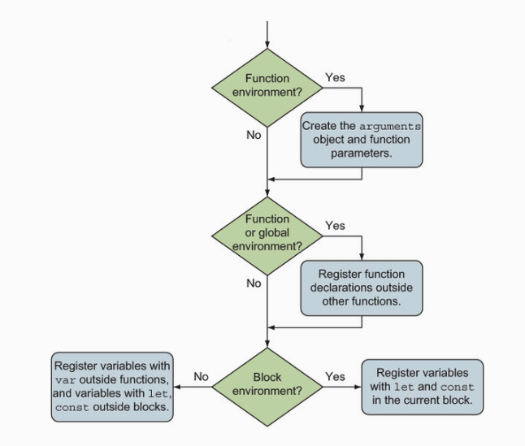

# 函数总结01 — 函数调用、作用域、词法环境

## 1. 函数调用

### 1. 隐式函数参数                            
当调⽤函数时，除了传⼊入在函数定义中显式声明的参数之外，同时还传⼊两个隐式参数:arguments 与 this。
- arguments 参数是传⼊入函数的所有参数的集合。具有 length 属性，表示传⼊入参数的个数，通过 arguments 参数还可获取那些与函数形参不匹配的参数。在⾮严格模式下，arguments 对象是函数参数的别名，修改 arguments 对象会修改函数实参，可以通过严格模式避免修改函数实参。  
- this 表示函数上下⽂，即与函数调用相关联的对象。函数的定义方式和调用⽅式决定了了 this 的取值。

### 2. 函数调用                                                      
- 作为函数调用：skulk()                                                       
- 作为⽅法调⽤:ninja.skulk()。                                                   
- 作为构造函数调⽤:new Ninja()。                                                     
- 通过 apply 与 call ⽅法调用:skulk.apply(ninja)或 skulk.call(ninja)。    

### 3. 函数上下文
1.函数的调⽤⽅式影响 this 的取值。                                                    
- 如果作为函数调用，在⾮严格模式下，this 指向全局 window 对象;在严格模式下，this 指向 undefined。                                                    
- 作为方法调⽤，this 通常指向调用的对象。                                                
- 作为构造函数调用，this 指向新创建的对象。                                                 
- 通过 call 或 apply 调⽤，this 指向 call 或 apply 的第一个参数。

2.箭头函数没有单独的 this 值，this 在箭头函数创建时确定。     
                                                  
3.所有函数均可使⽤bind ⽅法，创建新函数，并绑定到 bind ⽅法传⼊的参数上。被绑定的函数与原始函数具有一致的⾏为。

## 2. 闭包和作用域

### 1. 执行上下文栈（调用栈）

#### 概念:

1. JavaScript 代码有两种类型:一种是全局代码，在所有函数外部定义;一种是函数代码，位于函数内部。JavaScript 引擎执行代码时，每一条语句都处于特定的执行上下文中。

2. 两种类型的代码对应两种执行上下文：全局执行上下文和函数执行上下文。全局执行上下文只有一个，当JavaScript开始执行时就已经创建了全局上下文。函数执行上下文是每次调用函数时，就会创建一个新的。

3. 区分函数执行时通过关键字this访问的函数上下文和执行上下文，执行上下文是内部的JavaScript概念，JavaScript引擎通过使用执行上下文跟踪函数的执行。

#### 作用:

1. 跟踪函数的执行，JavaScript 基于单线程的执行模型:在某个特定的时刻只能执行特定的代码。一旦发生函数调用，当前的执行上下文必须停止执行，并创建新的函数执行上下文来执行函数。当函数执行完成后，将函数执行上下文销毁，并重新回到发生调用时的执行上下文中。所以需要跟踪执行上下文——正在执行的上下文以及正在等待的上下文。最简单的跟踪方法是使用执行上下文栈(或称为调用栈)。

2. 执行上下文除了可以跟踪应用程序的执行位置之外，对于标识符也是至关重要，在静态环境中通过执行上下文可以准确定位标识符实际指向的变量。

#### 原理：

1. 每个JavaScript程序只创建一个全局执行上下文，并从全局执行上下文开始执行，由于是单线程同一时间只能执行特定代码。当执行全局代码时，全局执行上下文处于活跃状态。

2. 在全局代码中定义skulk和report函数，当执行skulk('Kuma')函数时，由于是单线程，JavaScript引擎停止执行全局代码，创建新的skulk执行上下文，并压入执行上下文栈顶部。

3. skulk函数调用report函数，JavaScript引擎暂停skulk执行上下文，创建新的report执行上下文，并压入执行上下文栈顶部。

4. report函数执行完成，report执行上下文从栈顶弹出，skulk执行上下文重新激活，skulk函数重新执行。

5. skulk函数执行过程类似，执行完成后从栈顶弹出，重新激活全局执行上下文并恢复执行。JavaScript全局代码恢复执行。

### 2. 词法环境（作用域）

#### 概念:

1. 词法环境是JavaScript作用域的内部实现机制，人们通常称为作用域(scopes)。

2. 通常来说，词法环境与特定的 JavaScript 代码结构关联，既可以是一个函数、一段代码片段，也可以是 try-catch 语句。这些代码结构(函数、代码片段、try-catch)可以具有独立的标识符映射表。

3. 代码嵌套，词法环境主要基于代码嵌套，通过代码嵌套实现代码结构包含另一代码结构。在作用域范围内，每次执行代码时，代码都将获得与之关联的词法环境（每个执行上下文都有一个与之关联的词法环境）。


4. 代码嵌套与词法环境。除了跟踪局部变量，函数声明，函数的参数和词法环境外，还有必要跟踪外部（父级）词法环境。如果在当前环境中无法找到某个标识符，就需要访问外部环境在外部代码结构中查找。如果查找到了就会停止查找，如果查找到全局环境仍没有找到就会报错并停止查找。

5. 每个执行上下文都有一个与之关联的词法环境，词法环境中包含了上下文中定义的标识符的映射表。在特定的执行上下文中，程序不仅直接访问词法环境中定义的局部变量，而且还会访问外部环境中定义的变量。如何访问？见原理

#### 作用：

1.词法环境(lexical environment)是JavaScript引擎内部用来跟踪标识符与特定变量之间的映射关系。                    

#### 原理：


1. 无论何时创建函数，都会创建一个与之关联的词法环境，并存储在[[Enviroment]]的内部属性上。skulk函数保存全局环境的引用，report函数保存skulk环境引用，因为这些都是函数被创建时所在的环境。

2. 无论何时调用函数，都会创建一个新的函数执行上下文，并推入执行上下文栈，此外，还会创建一个与之相关联的词法环境。JavaScript引擎将此函数内置的[[Environment]]属性与创建此函数时的环境关联。skulk关联的是全局环境，report关联的是skulk环境。

3. 当调用skulk函数时，外部环境（这里是包含变量nijia的环境）与新创建的skulk环境成为全局环境，调用report函数时，外部环境（包含变量action的环境）与新创建的report环境被放入skulk环境中。

4. 执行report函数时，首先需要查找intro标识符的值，JavaScript引擎先检查当前执行上下文中的report函数环境，report环境中有intro变量的引用，所以intro标识符查找完成。

5. 查找ation标识符，又一次需要检查当前执行上下文的环境，report函数环境没有action标识符，JavaScript引擎查找report外部环境，skulk环境。skulk环境包含action标识符的引用，查找完成。查找ninja过程类似。

## 3. 关键字const, let, var与词法环境

### 变量可变性：

1. 按照可变性划分，const声明的变量不可变，var，let声明的变量可变。

2. const变量只能在声明时被初始化一次，之后再也不允许赋值。const主要用于不需要重新赋值的特殊变量或者指向一个固定的值。如const MAX_RONIN_COUNT = 11指定球队最大人数。

3. const一个重要特性，我们不能重写const变量，但是可以修改const变量已有对象。 

                     

### 关键字与词法环境关系：
1. 按照词法环境（作用域）可以将var分一组，let，const分一组。

2. 通过var声明的变量实际上总是在距离最近的函数内或者全局词法环境中注册的，不关注块级作用域。

```js
var globalNinja = "Yoshi";
                                    
function reportActivity() {
    var functionActivity = "jumping";                                    
    for (var i = 1; i < 3; i++) {
        var forMessage = globalNinja + " " + functionActivity;
//for循环中可以访问块级变量，函数内的局部变量，全局变量
        assert(forMessage === "Yoshi jumping","Yoshi is jumping within the for block");
        assert(i, "Current loop counter:" + i);                                
    }
//for循环外部可以访问for循环内部的变量                            
    assert(i === 3 && forMessage === "Yoshi jumping","Loop variables accessible outside of the loop");
}
                                    
reportActivity();
//函数外部无法访问函数内部的局部变量
assert(typeof functionActivity === "undefined"&& typeof i === "undefined" && typeof forMessage === "undefined","We cannot see function variables outside of a function");        
                                
//变量 forMessage 与 i 虽然是被包含在 for 循环中，但实际是在 reportActivity 环境中注册的 
```                                
 
                                 
3. 如下如所示，这里有三种词法环境：
- 变量globalNinja是在全局环境中定义的（距离最近的函数内或者全局词法环境）
- reportActivity函数创建的函数环境，包含变量functionaActivity，i，forMessage，这3个变量均通过关键字var定义的，与他们最近的是reportActivity函数，所以这几个变量实际是在reportActivity环境中注册。
- for循环的块级作用域，关键字var的变量忽略块级作用域。所以for循环里没有变量注册。


4. let和const在最近的词法环境中定义变量（可以是在块级作用域，循环内，函数内或者全局环境内）。可以使用let和const定义块级别，函数级别，全局级别的变量。

5. 如下图所示：
- 使用let定义的变量 forMessage与 i 是在 for 循环的块级作用域中定义的。变量在for块级环境中注册。
- 使用let定义的变量 functionActivity 是在函数 reportActivity 中定义的。变量在reportActivity函数级环境中注册。
- 使用const定义的变量GLOBAL_NINJA 是在全局环境中定义的。变量在全局环境中注册。           


### 在词法环境中注册标识符:

#### 概念：

JavaScript代码执行分两个阶段进行：
- 第一阶段：创建新的词法环境就会执行，这一阶段没有执行代码，JavaScript引擎会访问并注册在当前词法环境中声明的变量和函数。
- 第二阶段：第一阶段执行完毕后开始执行第二阶段，具体如何执行取决于变量的类型（let，var，const，函数声明）以及环境的类型（全局环境，函数环境，块级环境）。                         

第二阶段具体的执行过程：



1. 如果创建的是一个函数环境，函数的形参和函数参数的默认值会一同被创建，如果不是函数环境，跳过此步骤。

2. 如果创建的是一个全局或者函数环境，扫描当前代码并声明函数，此过程不会扫描其他函数体，也不会执行函数表达式或者箭头函数。对通过扫描找到的所有函数声明，会创建一个新函数并绑定到当前环境与函数名同名的标识符上。假如标识符的名字已经存在，它的值就会被新建的函数重写。假如不是全局或者函数环境，将会跳过此步骤。

3. 如果当前环境不是块级环境，查找所有在函数外，var声明的变量（它们可以被置于块级环境内 ）。还会查找所有在块级环境外，let和const声明的变量。如果是块级环境，在块级环境中查找在本块级环境中let和const声明的变量。对于被找到的每个变量，如果当前环境不存在此变量，就会创建标识符并初始化为undefined。如果标识符存在，就会保留其值。

#### 作用：

##### 1. 函数声明之前调用函数：


1. fun函数是通过函数声明进行定义的，在当前词法环境创建时，其他代码执行之前，就已经注册了函数的标识符。所以在执行函数调用之前，fun函数已经存在。

2. JavaScript允许我们直接使用函数引用，而不需要强制指定函数的顺序。

3. 需要特别注意的是，这种情况仅针对函数声明有效，函数表达式与箭头函数不在此过程中定义，而是在程序执行过程中定义的。

##### 2. 函数重载:


1. 声明的变量和函数使用相同的名字fun，两个断言都通过了，在第一个断言中标识符fun指向一个函数，在第二个断言中标识符指向一个数字。

2. JavaScript的这种行为是由标识符注册的结果导致的。在注册过程的第2步，通过函数声明进行定义的函数，在代码执行之前创建该函数，并赋值给对应的标识符；在注册第三步，处理变量的声明，那些在当前环境中未声明的变量，将被赋值为undefined。

3. 执行第一个断言fun === 'function'通过的原因是：通过注册过程第2步，注册函数声明时，标识符fun已经存在，并未被赋值为undefined。执行第二个断言fun === 'unmber'通过的原因是：执行赋值语句var fun = 3，数字3赋值给标识符fun，执行完这个赋值语句后，fun不再指向函数，而是指向数字3。          


