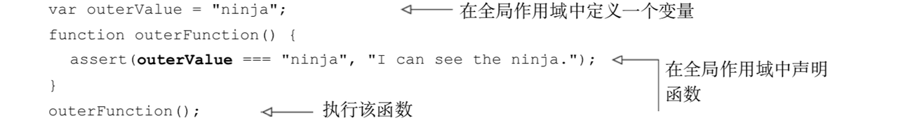
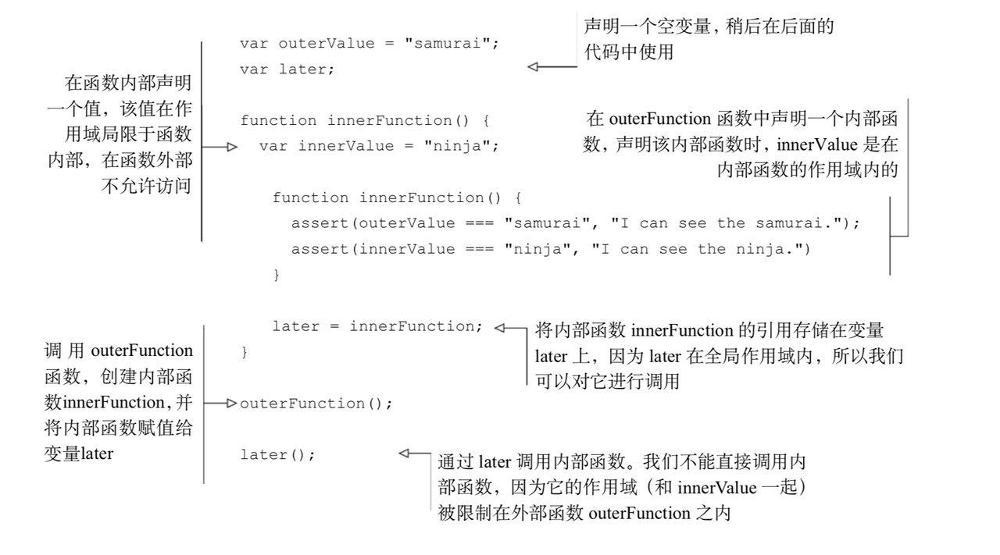
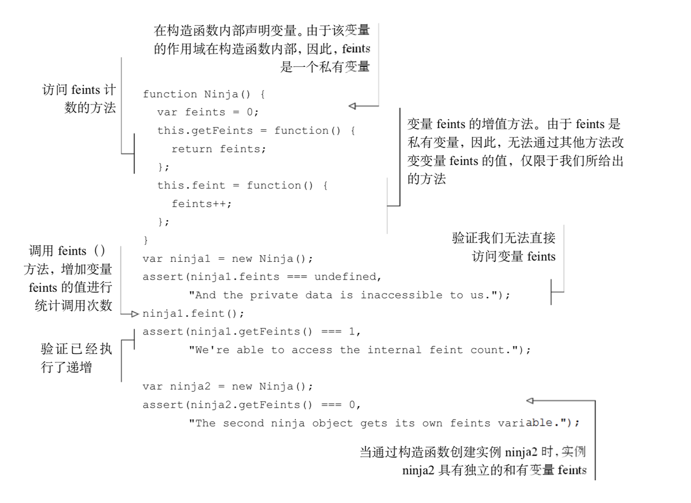
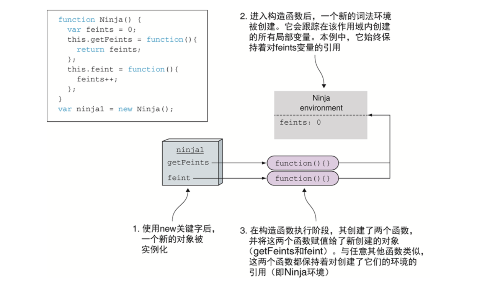
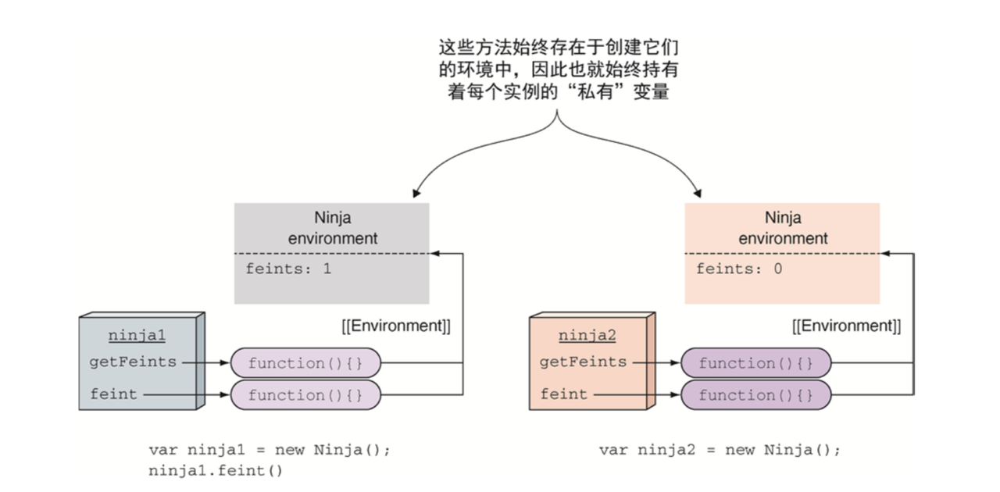
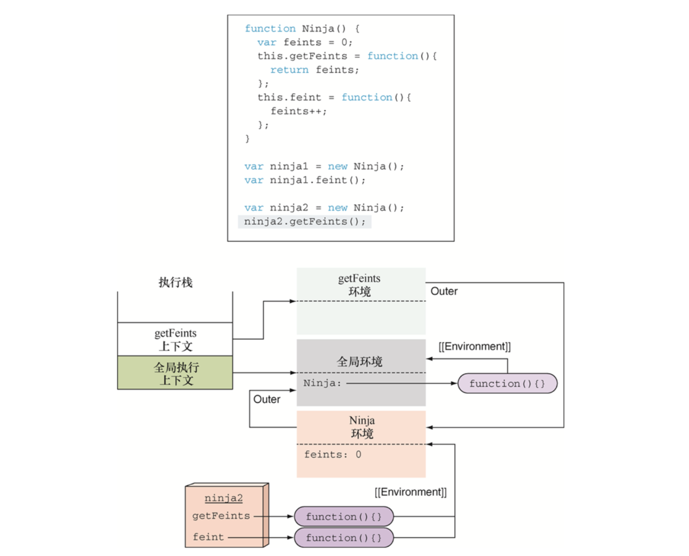
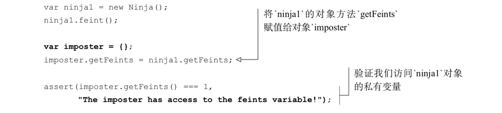
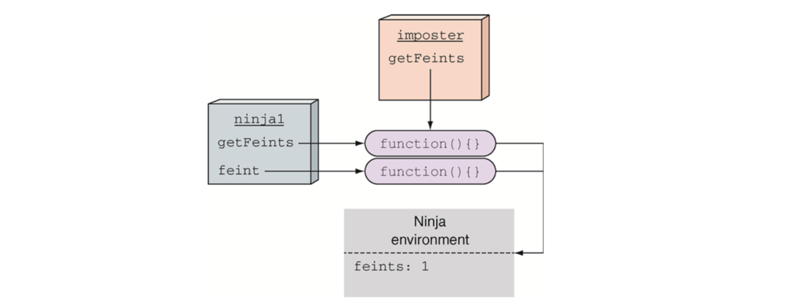
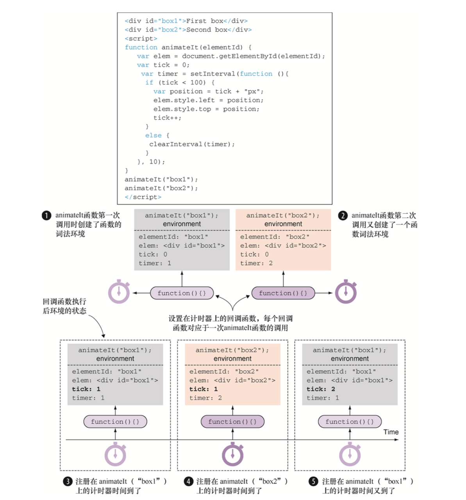

# 函数总结02 — 闭包原理

## 1. 闭包原理

### 概念：

1. 一个持有外部环境变量的函数就是闭包。

2. 闭包是词法作用域的体现，闭包是词法作用域链的延长，闭包和作用域是强相关的。

3. 闭包允许函数访问并操作函数外部的变量。只要变量或者函数存在于声明函数时的作用域内，闭包就可以使函数访问这些变量或函数。

4. 闭包内声明的函数可以在声明之后的任何时间被调用，甚至当该函数声明的作用域消失之后仍然可以调用。

5. 闭包影响性能。每一个通过闭包访问变量的函数都具有一个作用域链，作用域链包含闭包的全部信息。使用闭包时所用的信息都会存储在内存中，知道JavaScript引擎确保这些信息不再使用或者页面卸载时，才会进行垃圾回收清理这些信息。

### 作用：

#### 1. 全局作用域中的闭包

1. 以上代码就是一个闭包。

2. 外部外部变量outerValue和外部函数outerFunction都是在全局作用域内声明的，该作用域（实际上就是一个闭包）从未消失（只要应用处于运行状态）。该函数可以访问外部变量。

#### 2. 函数内部的闭包，函数在函数内部声明。（封装私有变量、回调函数）

1. 当外部函数中声明内部函数时，不仅定义了函数声明，而且还创建了一个闭包。

2. 该闭包不仅包含了函数的声明，还包含了函数声明时该作用域内的所用变量。

3. 当最终执行内部函数时，尽管声明时作用域已经消失了 ，但是通过闭包，仍然能够访问到原始作用域。

### 原理：

#### 1. 闭包模拟私有变量

1. 创建完成ninjia1后的状态。通过关键字new调用JavaScript 构造函数。每次调用构造函数时，都会创建一个新的词法环境，该词法环境保持构造函数内部的局部变量。

2. 创建函数时，函数都会通过内置的[[Environment]]属性保持对词法环境的引用。Ninja构造函数内部，getFeints和feint都有对Ninja环境的引用。因为Ninja环境是两个函数创建时所处的环境。

3. 可以通过Ninja构造函数内部访问getFeints与feint函数，实际上这就是创建了包含feints变量的闭包。

4. 当再创建一个Ninja的实例，ninja2时，将重复整个过程。

5. 每一个通过 Ninja 构造函数创建的对象实例均获得了各自的方法(ninja1.getFeints与 ninja2.getFeints 是不同的)，当调用构造函数时，各自的实例方法包含各自的变量。

6. 在调用 ninja2.getFeints 方法之前，JavaScript 引擎正在执行全局代码。我们的程序处于全局执行上下文状态，是执行栈里的唯一上下文。同时，唯一活跃的词法环境是全局环境，与全局执行上下文关联。

7. 当调用 ninja2.getFeints()时，我们调用的是 ninja2 对象的 getFeints 方法。由于每次调用函数时均会创建新的执行上下文，因此创建了新的getFeints执行环境并推入执行栈。这同时引起创建新的词法环境，词法环境通常用于保持跟踪函数中定义的变量。另外，getFeints 词法环境包含了 getFeints 函数被创建时所处的Ninja环境，当 ninja2 对象构建时，Ninja 环境是活跃的。

8. 获取 feints 变量时。首先，访问活跃的 getFeints词法环境。因为在 getFeints 函数内部未定义任何变量，该词法环境是空的，找不到 feints变量。接下来，在当前词法环境的外部环境进行查找——本例中，当创建 ninja2 对象时，Ninja 环境处于活跃状态。Ninja 环境中具有 feints 变量的引用，完成搜索过程。

9. 将 ninja1 的对象方法 getFeints 赋值给一个新的 imposter对象。然后，当我们通过对象 impostor 的 getFeints 方法，发现仍然可以访问 ninja1对象的私有变量。         
 

10. 在JavaScript中没有真正的私有对象属性，但是可以通过闭包实现一种可以接受的“私有”变量的方案。

#### 2. 闭包和回调函数     

1. 每次调用 animateIt 函数时，均会创建新的词法环境❶❷，该词法环境保存了动画所需的重要变量(elementId、elem、动画元素、tick、计数次数、timer、动画计数器的 ID)。只要至少有一个通过闭包访问这些变量的函数存在，这个环境就会一直保持。
            
2. 浏览器会一直保持 setInterval 的回调函数，直到调用 clearInterval 方法。随后，当一个计时器到期，浏览器会调用对应的回调函数，通过回调函数的闭包访问创建闭包时的变量。这样避免了手动匹配回调函数的麻烦，并激活变量(❸❹❺)，极大地简化代码。   