# 函数总结03 — Generator和Promise函数

## 1. 生成器函数（generator)

### 概念：

#### 1. 通过迭代器对象控制生成器

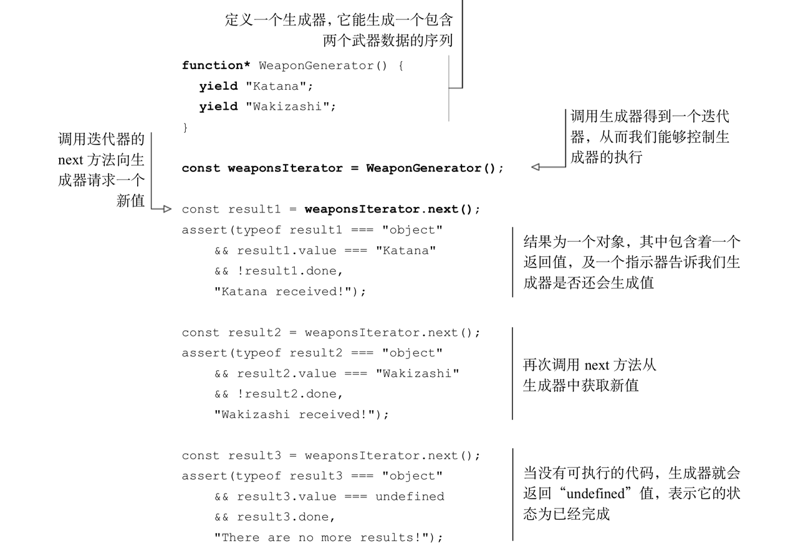

1. 调用const weaponsIteror = WeaponGenerator();生成器，返回一个迭代器。迭代器用于控制生成器的执行。
2. const result1 = weaponsIterator.next();迭代器对象暴露基本接口next，调用next函数后，生成器开始执行代码，当代码执行到yield关键字时，就会生成一个中间结果，然后返回一个新对象{value:xx, done:xx}。
3. 每当生成一个当前值后，生成器就会非阻塞的挂起执行，等待下次值请求到达。
4. 当第三次执行next方法后，生成器恢复执行，但是没有更多可执行代码了，生成器返回一个对象结果{value:undefined, done:true},表明工作已经完成了。

#### 2. 对迭代器进行迭代

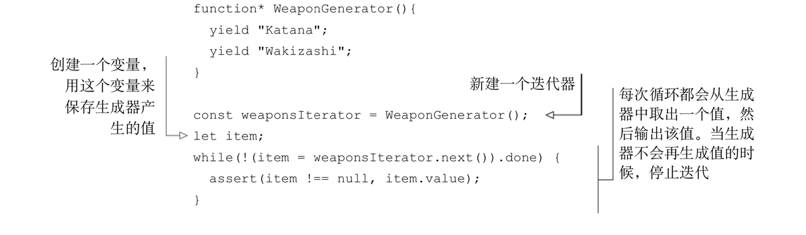

```js
//实际上是for-of的工作原理
for(var item of WeaponGenerator()) {
    assert(item !== null, item);
}
```

#### 3. 把执行权交给下一个生成器

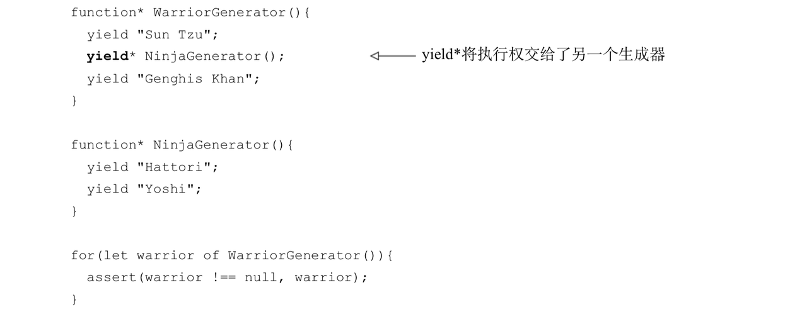

1. 在迭代器上执行yield* 操作符，程序会跳转到另外一个生成器函数上执行。

2. 程序从 WarriorGenerator 跳转到一个新的 NinjaGenerator 生成器上，每次调用WarriorGenerator 返回迭代器的 next 方法，都会使执行重新寻址到了 NinjaGenerator 上。该生成器会一直持有执行权直到无代码可以执行。

3. for-of循环不会关心 WarriorGenerator 委托到另一个生成器上，它只关心在 done 状态到来之前都一直调用 next 方法。

#### 4. 与生成器交互

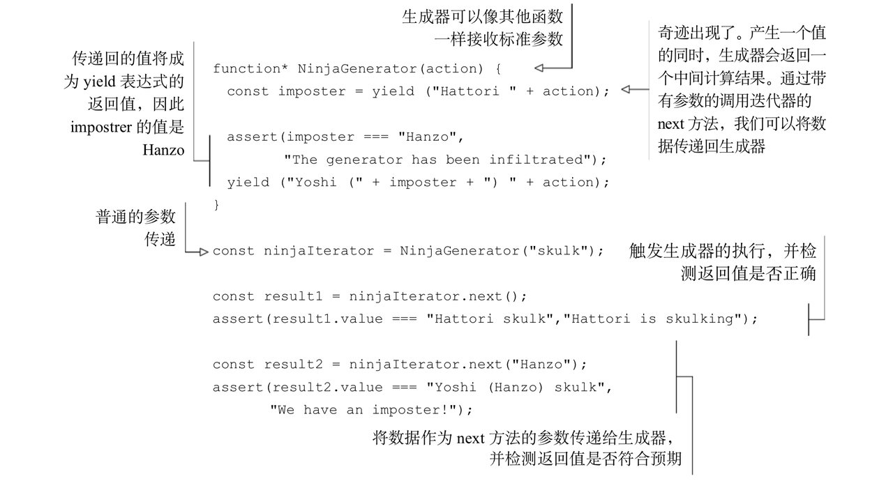

1. 作为生成器函数参数发送值。

2. 使用next方法向生成器发送值。                 
- 第二次调用 ninjaIterator 的 next 方法:ninjaIterator.next("Hanzo")。这一次，我们使用 next 方法将计算得到的值又传递回生成器。生成器函数在表达式 yield ("Hattori " + action)位置挂起，故而值 Hanzo 作为参数传入了 next()方法，并用作整个 yield 表达式的值。也就是表示语句 imposter = yield("Hattori " + action) 中的变量 imposter 会以值 Hanzo 作为结尾。

3. next方法为等待中的yield表达式提供了值，所以，如果没有等待中的yield表达式，也就没有值能应用了。基于这个原因我们无法通过第一次调用next方法来向生成器提供值。如果需要为生成器提供一个初始值，可以调用生成器自身。

#### 5. 抛出异常

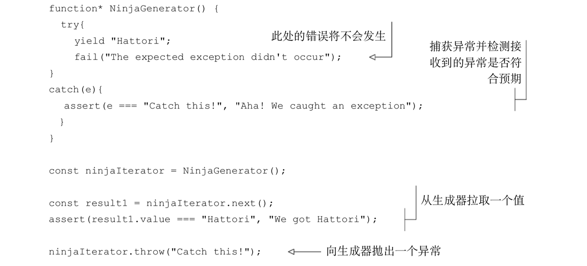

### 使用：

#### 1. 生成ID 序列

```js
function *IdGenerator(){
    let id = 0;
    while(true){                            
    yield ++id;
    }                              
} 
                             
const idIterator = IdGenerator();                                    
const ninja1 = { id: idIterator.next().value };
const ninja2 = { id: idIterator.next().value };
```

#### 2. 使用生成器遍历Dom树

```js
function* DomTraversal(element){
  yield element;
  element = element.firstElementChild;
  while (element) {                                     
    yield* DomTraversal(element);                
    element = element.nextElementSibling;
  }                     
}                       
const subTree = document.getElementById("subTree");
for(let element of DomTraversal(subTree)) {                            
  assert(element !== null, element.nodeName);
}
```

### 原理:

#### 1. 生成器的状态

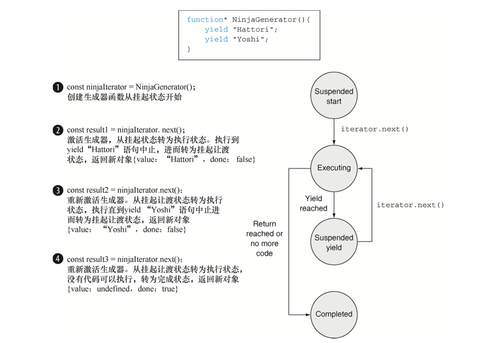

1. 挂起开始——创建了⼀个⽣成器后，它最先以这种状态开始。其中的任何代码都未执⾏。 

2. 执⾏——⽣成器中的代码已执⾏。执行要么是刚开始，要么是从上次挂起的时候继续的。当⽣成器对应的迭代器调用了 next 方法，并且当前存在可执⾏行行的代码时，生成器都会转移到这个状态。

3. 挂起让渡——当生成器在执⾏过程中遇到了一个 yield 表达式，它会创建一个包含着返回值的新对象，随后再挂起执行。⽣成器在这个状态暂停并等待继续执⾏。

4. 完成——在⽣成器执⾏期间，如果代码执行到 return 语句或者全部代码执⾏完毕，⽣成器就进入该状态。

#### 2. 通过执行上下文跟踪生成函数

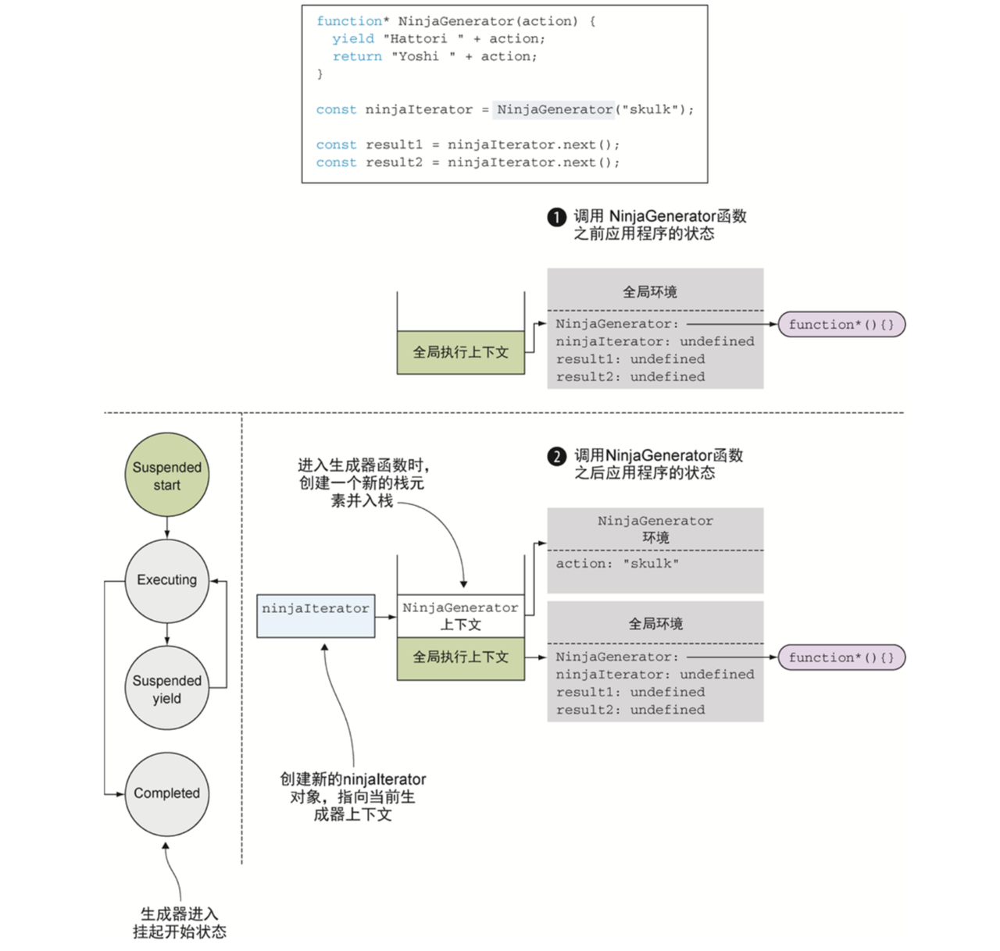

1. 当我们调用 NinjaGenerator 函数: const ninjaIterator = NinjaGenerator("skulk"); 控制流则进入了生成器，当前将会创建一个新的函数环境上下文 NinjaGenerator(和相对应的词法字典并列)，并将该上下文入栈。而生成器比较特殊，它不会执行任何函数代码。取而代之则生成一个新的迭代器再从中返回，通过在代码中用 ninjaIterator 可以来引用这个迭代器。由于迭代器是用来控制生成器的执行的，进而迭代器中保存着一个在它创建位置处的执行上下文。

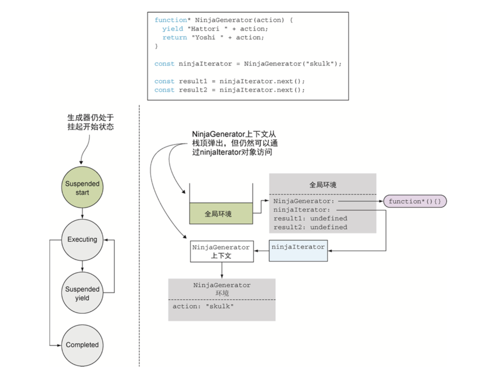

2. 当程序从生成器中执行完毕后，一般情况下，当程序从一个标准函数返回后，对应的执行环境上下文会从栈中弹出，并被完整地销毁。但在生成器中不是这样。由于 ninjaIterator 还保存着对它的引用，所以它不会被销毁。

3. 可以把它看作一种类似闭包的事物。在闭包中，为了在闭包创建的时􏰢保证变量都可用，所以函数会对创建它的环境持有一个引用。以这种方式，我们能保证只要函数还存在，环境及变量就都存在着。生成器，从另一个角度看，还必须恢复执行。由于所有函数的执行都被执行上下文所控制，故而迭代器保持了一个对当前执行环境的引用，保证只要迭代器还需要它的时候它都存在。

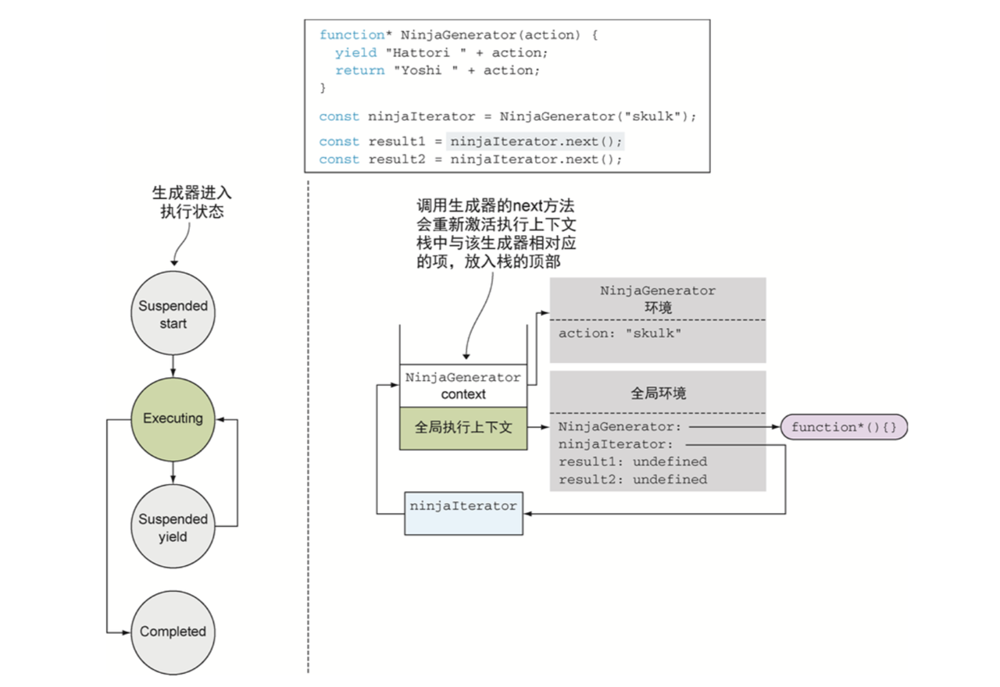

4. 当调用迭代器的 next 方法时const result1 = ninjaiterator.next();  如果这只是一个普通的函数调用，这个语句会创建一个新的 next()的执行环境上下文项，并放入栈中。但生成器不标准，对 next 方法调用的表现也很不同。它会重新激活对应的执行上下文。在这个例子中，是 NinjaGenerator 上下文，并把该上下文放入栈的顶部，从它上次离开的地方继续执行。                                                                          
5. 由于是第一次调用 next 方法，而生成器之前并没执行过，所以生成器开始执行并进入执行状态

6. 标准函数仅仅会被重复调用，每次调用都会创建一个新的执行环境上下文。相比之下，生成器的执行环境上下文则会暂时挂起并在将来恢复。

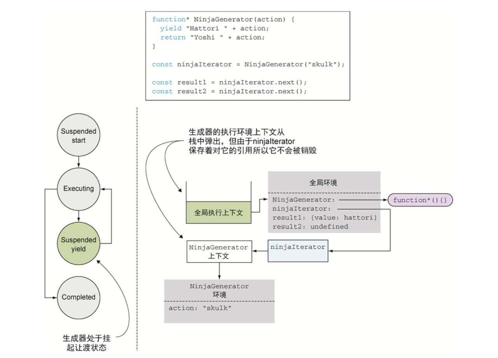

7. 当生成器函数运行到这个位置的时候 `yield "Hattori " + action；`生成器函数运行得到的表达式的结果为 Hattori skulk，然后执行中遇到了 yield 关键字。这种情况表明了Hattori skulk是该生成器的第一个中间值，所以需要挂起生成器的执行并返回该值。

8. 从应用状态的角度来看，发生了一件类似前面的事情:NinjaGenerator上下文离开了调用栈，但由于 ninjaIterator 还持有着对它的引用，它并未被销毁。现在生成器挂起了，又在非阻塞的情况下移动到了挂起让渡状态。程序在全局代码中恢复执行，并将生产出的值存入变量 result1。

9. 当遇到另一个迭代器调用时，代码继续运行: `const result2 = ninjaIterator.next();` 在这个位置，我们又把整个流程走了一遍:首先通过 ninjaIterator 激活 NinjaGenerator的上下文引用，将其入栈，在上次离开的位置继续执行。本例中，生成器计算表达式"Yoshi" + action。但这一次没再遇到 yield 表达式，而是遇到了一个 return 语句。这个语句会返回值 Yoshi skulk 并结束生成器的执行，随之生成器进入结束状态。

## 2.promise函数

### 原理：

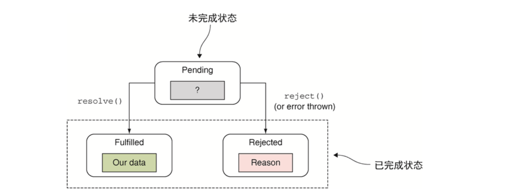

1. promise对象用于作为异步任务结果的占位符。它是一个我们暂时还没有获得但是未来有希望获得的值。
2. 一个promise对象从Pending状态开始，因为我们对promise一无所知，所有一个等待状态的promise对象也称作unresolved的promise。
3. 在程序执行过程中，如果promise的reslove函数被调用，promise就会进入Fulfilled状态。在该状态下能够获取到承诺的值。
4. 如果promise的reject函数被调用，或者一个未处理的异常在promise调用过程中发生了，promise就会进入Rejected状态。
5. 一旦某个promise进入到完成状态或者拒绝状态，它的状态都不能再切换了。

### 使用:

#### 1. 拒绝promise

```js
//1.显式拒绝：在promise执行函数中调用传入的reject方法
const promise = new Promise((resolve, reject)=>{
    reject('Explicitly reject a promise');
});
promise.then(
    ()=>fail("happy path, won't be called"),
//如果promise被拒绝，则第二个回调函数error总会被执行
    error=>pass("A promise was explicitly rejected!")
);

const promise = new Promise((resolve, reject)=>{
    reject("Explicitly reject a promise!");
});
//在then状态后链式调用catch方法，也可以在promise进入拒绝状态时提供错误回调函数
promise.then(()=>fail("happy path, won't be called"))
        .catch(()=>pass("Promise was also rejected"));

//2.隐式拒绝：promise执行过程中遇到异常，可以被隐式拒绝。
const promise = new Promise((reslove, reject)=>{
//未被定义的变量，执行时会报错
    undeclaredVariable++;
});
//发生了异常，第二个回调函数error被调用
promise.then(()=>fail("happy path, won't be called!"))
        .catch(error=>pass("third promise was also rejected!"));
```
#### 2. 链式调用
```js
function getJSON(url) {
  return new Promise((resolve, reject)=>{
    const request = new XMLHttpRequest();
      request.open('GET', url);
      request.onload = function () {
        try {
          if(this.status === 200) {
            resolve(JSON.parse(this.response));
          }else {
            reject(this.status + " " + this.statusText);
          }
        }catch (e){
            reject(e.message);
        }
        request.onerror = function() {
          reject(this.status + " " + this.statusText);
        );

        request.send();
      })
}

//链式调用，处理相互依赖的请求
getJSON("data/ninjias.json")
    .then(ninjas=>getJSON(ninjas[0].missionsUrl))
    .then(missions=>getJSON(missions[0].detailsUrl))
    .then(mission=>assert(mission !== null, 'ninja mission obtained!'))
    .catch(error=>fail('An error has occurred'));

//1.调用then方法后会返回一个新的promise对象。
//2.Promise中错误的捕捉：通过then方法传递第二个回调函数；链式的调用一个catch方法，并传入错误处理回调函数。
```

#### 3. Promise.all
```js
Promise.all([getJSON("data/ninjas.json"),
            getJSON("data/mapInfo.json"),
            getJSON("data/plan.json")])
        .then(results=>{
            const ninjas = results[0];
            const mapInfo = results[1]; 
            const plan = results[2];
            
        })
        .catch(error=>{
            fail("A problem in carrying out our paln!");
        })
//处理并行任务
//1.使用Promise.all可以等待多个promise。
//2.这个方法将一个promise数组作为参数，然后创建一个新的promise对象，一旦数组中的promise全部被解决，这个返回的 promise 就会被解决，而一旦其中有一个promise失败了，那么整个新promise对象也会被拒绝。
//3.后续的回调函数接收成功值组成的数组，数组中的每一项都对应 promise 数组中的对应项。 
```

#### 4. Promise.race 
```js
Promise.race([getJSON('/data/youshi.json'),
              getJSON('/data/hattori.json'),
              getJSONS('/data/hanzo.json')])
    .then(ninja=>{
        assert(ninja !== null, ninja.name + ' responded first');
    }).catch(error=>fail('Failure!'));

//1.一旦数组中某一个promise被处理或被拒绝，这个返回的promise就同样会被处理或被拒绝。
```

#### 5. generator和promise结合处理相互依赖的异步任务

```js
//1.代码相互依赖执行，如下使用同步代码会阻塞UI
try {
  const ninjas = syncGetJSON('data/ninjas.json');
  const missions = syncGetJSON(ninjas[0].missionsUrl);
  const missionDetails = syncGetJSON(mission[0].detailsUrl);
}catch {
    //some error occured.
}                        

//2.使用生成器和promise结合处理相互依赖运行的异步代码。
//我们不知道promise何时返回，所以生成器执行的时候，把控制权让渡给生成器，从而不会导致阻塞。
async(function*() {
    try {
        const ninjas = yield getJSON('data/ninjas.json');
        const mission = yield getJSON(ninjas[0].missionsUrl);
        const missionDescription = yield getJSON(mission[0].detailsUrl);
    }catch (e) {
        //some error occured
    }
})

function async(generator) {
    var iterator = generator();
    function handle(iteratorResult) {
//生成器没有更多结果返回时停止执行
        if(iteratorResult.done) {return;}
        const iteratorValue = iteratorResult.value;
//如果生成的值是一个promise，则对其注册成功和失败回调。这是异步处理的部分。如果promise成功返回，则恢复生成器的执行并传入 promise 的返回结果。如果遇到错误，则向生成器抛出异常 
        if(iteratorValue instanceof Promise) {        
            iteratorValue.then(res=>handle(iterator.next(res)))
                        .catch(err=>iterator.throw(err));
        }
    }
//启动生成器执行
    try{
        handle(iterator.next());
    }catch(e) {
        iterator.throw(e);
    }
}


//3.使用自带的async函数，js针对生成器和promise封装了async和await，简化了使用。
  //通过关键字async，表明当前的函数依赖一个异步返回值。
  //每个调用异步任务的位置上都要放置一个await关键字。用来告诉JavaScript引擎，在不阻塞应用执行的   情况下在这个位置等待执行结果。 
(async function() {
    try {
        const ninjas = await getJSON('data/ninjas.json');
        const missions = await getJSON(mission[0].missionUrl);
        console.log(missions);
    }catch(e) {
        
    }
})();

//4.总结使用的知识点
//函数是第一类对象 ---- 向async函数传入一个参数，该参数也是函数。
//生成器函数 ---- 用它的特性来挂起和恢复执行。
//promise ---- 处理异步代码。
//回调函数 ---- 在promise对象成功和失败回调函数。
//箭头函数 ---- 简化代码
//闭包 ---- 在控制生成器的过程中，迭代器在async函数内被创建，我们在promise的回调函数内通过闭包来获取改迭代器。
```
