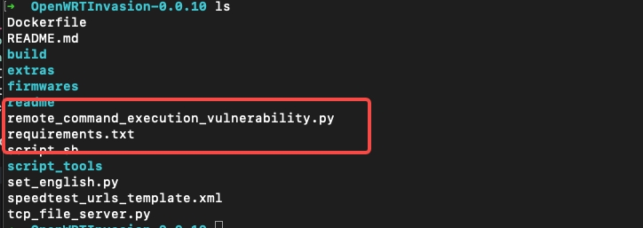

# 小米路由器4A千兆版刷入三方固件

概要：获取路由器的root权限后刷固件。

## 1.获取root权限

下载openWRT: https://github.com/acecilia/OpenWRTInvasion
按照openWRT demo执行

下载telnet: 直接使用homebrew安装 `brew install telnet`

切换到OpenWRTInvasion目录下执行
python3

