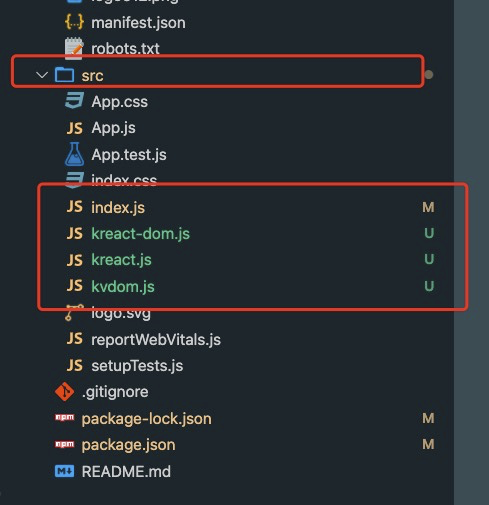

# React基本原理1

> ### 虚拟dom的渲染过程

## 1. JSX语法：
   
   1. [JSX 简介 – React](https://zh-hans.reactjs.org/docs/introducing-jsx.html) JS语法扩展。
   
   2. 需要注意的是用JSX表示对象的时候，Babel 会把 JSX 转译成一个名为 React.createElement() 函数调用。
```js
const element = 
      <h1 className="greeting">
      Hello, world!
      </h1>
      );
      
//<h1>不是html里的标签通过Babel转义后;

const element = React.createElement(
  'h1',
  {className: 'greeting'},
  'Hello, world!'
); 
``` 

3. 对于子组件的转化 
   
   官网Demo可以验证 [React 官方中文文档 – 用于构建用户界面的 JavaScript 库](https://zh-hans.reactjs.org/)
   ```js
      // JSX:
      class HelloMessage extends React.Component {
      render() {
      return (
      
      <div name="foo" style="color:red">
      Hello {this.props.name}
      <div> 
       <Comp/>
      </div>
      </div>
      );
      }
      }
    //通过Babel转义后：
      class HelloMessage extends React.Component {
        render() {
            return React.createElement(
                "div", //标签名
                { name: "foo", style: "color:red" },
                "Hello ",
                this.props.name,
            React.createElement(
                "div",
                null,
                React.createElement(Comp, null)
            )
        );
        }}
   ```


## 2.虚拟Dom转化为对象：
   
   1. React.createElement()做类型检查的时候将虚拟Dom转化为对象。实际上React就是将这个对象转化成真实的Dom。

   ```js
      const element = (
        <h1 className="greeting">
          Hello, world!
        </h1>
      );

      //将<h1>和props等虚拟Dom转化为对象：

      const element = {
        type: 'h1',
        props: {
          className: 'greeting',
          children: 'Hello, world!'
      }
    };

   ```

## 3.React如何将虚拟Dom渲染为Dom
### 3.1 React中的三个主要Api：

+ [React.js文件](https://github.com/facebook/react/blob/master/packages/react/src/React.js)
   - React.Component ：实现自定义组件
   - React.createElement：创建虚拟DOM
   
+ [ReactDom.js文件](https://github.com/facebook/react/blob/master/packages/react-dom/src/client/ReactDOM.js)
   - ReactDom.render：渲染真实DOM

### 3.2 动动小手实现基本过程：
+ 需要实现的过程
  - index.js 页面
  - kreact.js 实现createElement、Component两个函数
  - kreact-dom.js 实现render函数，将虚拟Dom转化为Dom
  - kvdom.js  具体的虚拟Dom转化为Dom函数
+ 具体实现
  - index.js:
```js
// import React from 'react';
// import ReactDOM from 'react-dom';

import React, {Component} from './kreact'
import ReactDOM from './kreact-dom'

function Comp(props) {
  return <h2>hi {props.name}</h2>
}

class Comp2 extends Component {
  render() {
    return (
      <div>
        <h2>hi {this.props.name}</h2>
      </div>
    )
  }
}

const users = [{name:'tom', age:20}, {name:'jerry', age:20}]

const jsx = (
  <div id='demo' style={{color:'red', border:'1px solid green'}}>
    <span onClick={()=>alert("click")}>hi</span>
    <Comp name='函数组件'/>
    <Comp2 name='类组件'/>
    <ul>
      {users.map(user => (
        <li key={user.name}>{user.name}</li>
      ))}
    </ul>
  </div>
);

console.log(JSON.stringify(jsx,null,2));

ReactDOM.render(
  jsx,
  document.getElementById('root')
);

```
console.log打印的结果：
createElement()将标签解析成JSON，render的时候就是将这里面的数据转换成Dom然后再渲染出来。
```js
{
  "vtype": 1,
  "type": "div",
  "props": {
    "id": "demo",
    "style": {
      "color": "red",
      "border": "1px solid green"
    },
    "children": [
      {
        "vtype": 1,
        "type": "span",
        "props": {
          "children": [
            "hi"
          ]
        }
      },
      {
        "vtype": 3,
        "props": {
          "name": "函数组件",
          "children": []
        }
      },
      {
        "vtype": 2,
        "props": {
          "name": "类组件",
          "children": []
        }
      },
      {
        "vtype": 1,
        "type": "ul",
        "props": {
          "children": [
            [
              {
                "vtype": 1,
                "type": "li",
                "props": {
                  "key": "tom",
                  "children": [
                    "tom"
                  ]
                }
              },
              {
                "vtype": 1,
                "type": "li",
                "props": {
                  "key": "jerry",
                  "children": [
                    "jerry"
                  ]
                }
              }
            ]
          ]
        }
      }
    ]
  }
}

```
  - kreact.js
```js
import {createVNode} from './kvdom'

function createElement(type, props, ...children){
    // console.log(arguments);
    props.children = children;
    delete props.__source;
    delete props.__self; 
    //type区分：div、span等原生标签、class组件、function组件
    let vtype;
    if(typeof type === 'string') {
        //原生组件
        vtype = 1;
    }else if(typeof type === 'function') {
        //typeof判断class和function都是function类型
        if(type.isClassComponent) { //通过class里内置的属性区分class组件和function组件
            //class组件
            vtype = 2;
        }else {
            //function组件
            vtype = 3;
        }
    }
    return createVNode(vtype, type, props);
};

const React = {
    createElement,
}

export default React;

export class Component {
    //帮助判断是class还是function组件
    static isClassComponent = true;
    constructor(props) {
        this.props = props;
        this.state = {};
    }
    setState(){}
}


```
- kreact-dom.js
```js
import {initVNode} from './kvdom'
function render(vnode, container) {
    //将虚拟Dom转化为真是Dom
    const node = initVNode(vnode);
    container.appendChild(node);
    // container.innerHTML = `<pre>${JSON.stringify(node, null, 2)}</pre>`;
}
const ReactDom = {
    render,
}
export default ReactDom;
```


- kvdom.js:
```js
//vdom -> dom
//diff 
//vtype元素类型： 1-html 2-function 3-class 
export function createVNode(vtype, type, props) {
    const vnode = {vtype, type, props};
    return vnode;
}

export function initVNode(vnode) {
    const {vtype} = vnode;
    if(!vtype) {
        //文本节点
        return document.createTextNode(vnode);
    }
    if(vtype == 1) {
        return createElement(vnode);
    }else if(vtype == 2) {
        return createClassComponent(vnode);
    }else {
        return createFunctionComponent(vnode);
    }
}

function createElement(vnode) {
    //根据type创建元素
    const {type, props} = vnode;

    const node = document.createElement(type);
    
    //处理属性
    const {key, children, ...rest} = props;
    Object.keys(rest).forEach(k => {
        //处理特殊的属性名
        if(k === 'className') {
            node.setAttribute("class", rest[k]);
        }else if(k === 'style' && typeof rest[k] === 'object') {
            const style = Object.keys(rest[k]).map(s=>s + ":" + rest[k][s]).join(";");
            node.setAttribute("style", style);
        }else if(k.startsWith('on')) {
            const event = k.toLowerCase();
            node[event] = rest[k];
        }else {
            node.setAttribute(k, rest[k]);
        }
    })
    
    //递归子元素
    children.forEach(c => {
        if(Array.isArray(c)) {
            c.forEach(n => node.appendChild(initVNode(n)));
        }else {
            node.appendChild(initVNode(c));
        }
    });
    
    return node;

}

function createClassComponent(vnode) {
    const {type, props} = vnode;
    //创建实例
    const component = new type(props);
    const vdom = component.render();
    return initVNode(vdom);
}

function createFunctionComponent(vnode) {
    const {type, props} = vnode;
    //函数直接调用
    const vdom = type(props);
    return initVNode(vdom);
}
```

## 4. 实践步骤
   
   1. 新建一个react项目
      
      1. [如何用vscode启动react项目 - html中文网](https://www.html.cn/qa/react/15125.html)
   
   2. 遇到create-react-app不能执行
      
      1. [zsh: not found create-react-app # · Issue #10320 · facebook/create-react-app](https://github.com/facebook/create-react-app/issues/10320)
   
   3. 文件目录如下：
   
   

   4. 使用react16验证。
